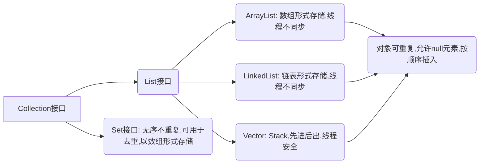
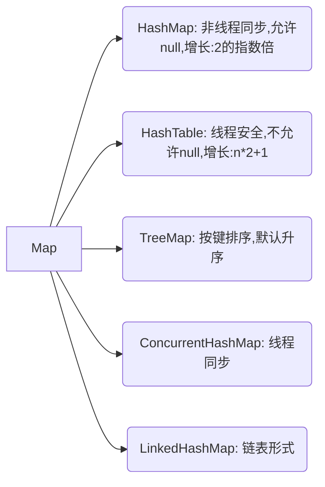

# 一.基础

## 基本功

### 1.1 面向对象的特征

- 封装
- 继承
- 多态

封装是Java类的编写规范、继承是类与类之间联系的一种形式、而多态为系统组件或模块之间解耦提供类解决方案


类的实例化过程：

1. JVM读取指定classpath路径下的class文件，加载到内存，如果有直接父类，也会加载父类；
2. 堆内存分配空间；
3. 执行父类、子类静态代码块；
4. 对象属性进行默认初始化；
5. 调用构造方法；
6. 在构造方法中，先调用父类构造方法初始化父类数据；
7. 初始化父类数据后，显示初始化，执行子类的构造代码块；
8. 再进行子类构造方法的特定初始化；
9. 初始化完毕后，将地址赋值给引用

### 1.2 final, finally, finalize 的区别

- final

  > 声明属性、方法、类

修饰属性：表示属性不可变

修饰方法： 表示方法不能重写

修饰类： 表示类不可继承

- finally

  是异常处语句的一部分，表示被finally包裹的代码段无论触发异常与否，都会执行

- finalize

  是Object类的一个方法。当垃圾收集器进行资源回收时，会调用对象的此方法来进行垃圾回收、资源释放

### 1.3 int和Integer的区别

- Integer是int的包装类，int则是Java的一种基本数据类型
- Integer变量必须实例化后才能使用，而int变量不需要
- Integer实际是对象引用，当new一个Integer时，实际上是生成一个指针指向此对象；而int则是直接存储数据值
- Integer的默认值是null，int的默认值是0

#### Integer和int的比较

1. 由于Integer变量实际上是对一个Integer对象的引用，所以两个通过new生成的Integer变量永远是不可能相等的(因为new生成的两个对象，其内存地址不同)

   ```java
   Integer i = new Integer(100);
   Integer j = new Integer(100);
   System.out.println(i == j); // false
   ```

2. Integer变量和int变量比较时，只要两个变量的值是相等的，则结果是true(因为包装类Integer和基本数据类型int比较时，Java会自动拆包装为int，然后进行比较，实际上就变为两个int变量的比较)

   ```java
   Integer i = new Integer(100);
   int j = new Integer(100);
   System.out.println(i == j); // true
   ```

3. 非new生成的Integer变量和new Integer()生成的变量比较时候，结果为false。(因为非new生成的Integer变量指向的是Java常量池中的对象，而new Integer()生成的变量指向堆中新建的对象，两者在内存中的地址不同)

   ```java
   Integer i = new Integer(100);
   Integer j = 100;
   System.out.print(i == j); //false
   ```

4. 对于两个非new生成的Integer对象，进行比较时，如果两个变量的值在区间-128到127之间，则比较结果为true，如果两个变量的值不在此区间，则比较结果为false

   ```java
   Integer i = 100;
   Integer j = 100;
   System.out.print(i == j); //true
   
   Integer i = 128;
   Integer j = 128;
   System.out.println(i == j); // false
   ```

   源码分析：

   Java对于-128到127之间的数，会进行缓存，比较的时候直接获取不会重新new了

   ```java
       /**
        * Returns an {@code Integer} instance representing the specified
        * {@code int} value.  If a new {@code Integer} instance is not
        * required, this method should generally be used in preference to
        * the constructor {@link #Integer(int)}, as this method is likely
        * to yield significantly better space and time performance by
        * caching frequently requested values.
        *
        * This method will always cache values in the range -128 to 127,
        * inclusive, and may cache other values outside of this range.
        *
        * @param  i an {@code int} value.
        * @return an {@code Integer} instance representing {@code i}.
        * @since  1.5
        */
       public static Integer valueOf(int i) {
           if (i >= IntegerCache.low && i <= IntegerCache.high)
               return IntegerCache.cache[i + (-IntegerCache.low)];
           return new Integer(i);
       }
   ```


### 1.4 重载和重写的区别

#### 重写(Override)

- 发生在父类和子类之间
- 方法名、参数列表、返回类型相同
- 访问修饰符的限制一定要大于被重写方法的访问修饰符(public>protected>default>private)
- 重写方法一定不能抛出新的检查异常活着比重写放噶声明更加宽泛的检查型异常

#### 重载(Overload)

- 重载Overload是一种类中多态性的一种表现
- 重载要求同名方法的参数列表不同(参数类型，参数个数甚至是参数顺序)
- 重载的时候，返回值类型可以相同也可以不同。无法以返回类型作为重载寒暑的区分标准

#### 面试小结(Override与Overload的区别)

方法的重载和重写都是实现多态的方式，区别在于前者实现的是编译时的多态性，而后者是运行时的多态性。重载发生在一个类中，同名的方法如果有不同的参数列表则视为重载；重写发生载子类与父类之间，重写要求子类被重写方法与父类被重写方法有形同的参数列表，有兼容的返回类型，比父类被重写方法更好的访问权限，不能比父类被重写方法声明更多的异常(里氏代换原则)。重载对返回类型没有特殊要求，不能根据类型进行区分。


### 1.5 抽象类和接口有什么区别

#### 抽象类

含有abstract修饰符class是抽象类，抽象类不能创建实际对象，含有抽象方法的抽象类必须定义为abstract class

#### 接口

接口可以说是一种特殊的抽象类，是比抽象类更抽象的类，接口中的方法默认定义为public abstract类型，接口中的成员变量类型默认是public static final

#### 区别

1. 抽象类可以有构造方法，接口中不能有构造方法
2. 抽象类中可以有普通成员变量，接口中没有普通成员变量
3. 抽象类中可以包含非抽象普通方法，接口中所有的方法必须都是抽象的，不能有非抽象的方法
4. 抽象类中的抽象方法的访问权限可以是public、protected、default，接口中的抽象犯法只能是public，并且默认是public abstract类型
5. 抽象类中可以包含静态方法，在JDK1.8之前接口中不能包含静态方法，JDK1.8后可以包含
6. 抽象类和接口中都可以包含静态成员变量，抽象类中静态成员变量的访问权限可以是任意的，但接口中定义的变量只能是public static final类型的，并且默认是public static final类型
7. 一个类可以实现多个接口，只能继承一个抽象类，接口不可以实现接口，但可以继承接口，并且可以继承多个接口

### 1.6 说说反射的用途及实现

JVM在运行时动态加载类或者调用方法/访问属性，无需事先知道运行对象

#### Java反射框架主要提供的功能

1. 在运行时判断任意一个对象所属的类
2. 在运行时构造任意一个类的对象
3. 在运行时判断任意一个类所具有的成员变量和方法(可以调用private方法)
4. 在运行时调用任意一个对象的方法

#### 主要用途

开发各种通用框架

#### 基本反射功能的实现(java.lang.relfect)

- 获得Class对象

  1. 使用Class类的forName静态方法
  2. 直接获取某一个对象的class
  3. 调用某个对象的getClass方法

- 判断是否是某个类的实例

  用instanceof 关键字来判断是否为某个类的实例

- 创建实例

  1. 使用Class对象的newInstance方法来创建Class对象对应类的实例
  2. 先通过Class对象获取指定的Constructor对象，再调用Constructor对象的newInstance方法来创建实例

- 获取方法

  getDeclaredMethods

- 获取构造器信息

  1. getDeclaredMethods
  2. getMethods
  3. getMethod

- 获取类的成员变量信息

  1. 获取公有的成员变量 getFiled
  2. 获取所有已声明的成员变量，但是不能得到其父类的成员变量getFileds 和getDeclaredFields用法

- 调用方法

  invoke()

- 创建数组

  Array.newInstance()

#### 注意

反射会额外消耗一定的系统资源，因此如果不需要动态创建一个对象，那么就不需要用反射。另外，反射调用方法时可以忽略权限检查，因此可能破坏封装性而导致安全问题


### 1.7 说说自定义注解的场景及实现

#### Java元注解

```java
// 定义注解的保留期限，如通过反射来读取注解信息，可定义为RententionPolicy.RUNTIME
@Retention
@Inherited
@Documented
// 定义注解的应用目标，如方法级别ElementType.METHOD
@Target
```

#### 自定义注解的使用场景

1. 类属性自动赋值
2. 验证对象属性完整性
3. 代替配置文件功能，如spring基于注解的配置
4. 可以生成文档，如Java代码注释中的@see，@param等


### 1.8 HTTP 请求的 GET 与 POST 方式的区别

1. GET在浏览器回退时时无害的，而POST会再次提交请求

2. GET产生的URL地址可以被BookMark，而POST不可以

3. GET请求会被浏览器主动cache，而POST不会，除非手动设置

4. GET请求只能进行URL编码，而POST支持多种编码方式

5. GET请求参数会完整保留在浏览器历史记录里，而POST中的参数不会被保留

6. GET请求在URL中传送的参数是有长度限制的，而POST没有限制

   > 浏览器限制URL长度2k个字节，服务器限制64k大小的URL

7. 对于参数类型，GET只接受ASCII字符，而POST没有限制

8. GET比POST更不安全，因为参数直接暴露在URL上，所有不能用来传递敏感信息

9. GET参数通过URL传递，POST放在Request Body中

#### HTTP

基于TCP/IP的关于数据如何在万维网中如何通信的协议。底层四TCP/IP

#### 重大区别

GET产生一个TCP数据包，POST产生两个TCP数据包

> 对于GET，浏览器把http header和data一并发送出去，服务器响应200;
>
> 对于POST，浏览器会先发送header，服务器响应100 continue，浏览器再发送data,服务器响应200 ok。


### 1.9 session 与 cookie 区别

1. cookie是一种发送到客户端浏览器的文本串句柄，并保存在客户机硬盘上，可以用于在某个web站点会话间持久的保持数据。
2. session是访问者从到达某个特定主页到离开为止的那段时间。session其实就是利用cookie进行信息处理的，当用户进行了请求落后，服务端就在用户浏览器上创建一个cookie，当这个session结束时，其实就是意味着这个cookie过期了 
3. cookie和session都是用来跟踪浏览器用户身份的会话方式
4. cookie和session的区别是： cookie数据保存在客户端，session数据保存在服务器端

### 1.10 session 分布式处理

#### 实现方式

1. 基于数据库的session共享
2. 基于NFS共享文件系统
3. 基于memcached的session，如何保证memcached本身的高可用？
4. 基于redis/tomcat web容器本身的session复制机制
5. 基于TT/Redis 或者jbosscache进行session共享
6. 基于cookie进行session共享

#### Session Replication 方式管理

- 简介

  将一台机器上的session数据广播复制到集群中其余机器上

- 使用场景

  机器较少，网络流量较少

- 优点

  实现简单、配置较少、当网络中有机器宕机时不影响用户访问

- 缺点

  广播式复制到其余机器有一定的延时，带来一定的网路开销

#### Session Sticky 方式管理

- 简介

  粘性session。当用户访问集群中某台机器后，强制指定后续所有请求均落到此机器上

- 使用场景

  机器数适中、对稳定性要求不是非常苛刻

- 优点

  实现简单、配置方便、没有额外网络开销

- 缺点

  网络中有机器宕机时、用户session会丢失、容易造成单点故障

### 缓存集中式管理

- 简介

  将session存入分布式缓存集群中的某台机器上，当用户访问不同节点时先从缓存中拿session信息

- 使用场景

  集群中机器数量较多、网络环境复杂

- 优点

  可靠性好

- 缺点

  实现复杂、稳定性依赖于缓存的稳定性、session信息放入缓存时要有合理的策略写入

### 1.11 JDBC 流程

1. 装载驱动程序
2. 建立与数据库的连接
3. 执行SQL语句
4. 获取执行结果
5. 清理资源


### 1.12 MVC 设计思想

M:	modle 模型，程序员编写程序应有的功能、数据库专家进行数据管理和数据库设计

V:	view 视图 界面设计人员进行图形界面设计

C：controller 控制器 负责转发请求，对请求进行处理

MVC模式(Model-view-controller) 是软件工程中的一种软件架构模式，把软件系统分为三个基本部分：模型、视图、控制器。MVC模式的目的是实现一种动态的程序设计，使后续对程序的修改和扩展简化，并且使程序某一部分的重复利用成为可能。通过对复杂度的简化，使程序结构更加直观。软件系统通过对自身基本部分分离的同时也赋予了各个基本部分应有的功能：

### 1.13 equals 与 == 的区别

equals比较值，==比较地址


## 集合

### 1.14 List、Set、Map的区别

#### Colletion



##### List

1. 可以允许重复的对象
2. 可以插入多个null元素
3. 是一个有序容器，保持了每个元素的插入顺序，输出的数据就是插入的顺序
4. 常用实现类：ArrayList、LinkedList、Vector

##### Set

1. 不允许重复对象
2. 无序容器，无法保证每个元素的存储顺序，TreeSet通过Commparator或者Comparable维护了一个排序顺序
3. 只允许一个null元素
4. 实现类：HashSet、LinkedHashSet、TreeSet

#### Map




1. Map不是Collection的子接口或者实现类。Map是一个接口
2. Map的每个Entry都持有两个对象，也就是一个键一个值，Map可能会持有相同的值对象但是键对象必须是唯一的
3. TreeMap也通过Commparator或者Comparable维护了一个升序顺序
4. Map里你可以拥有多个null值，但最多只能有一个null键
5. Map的实现类HashMap、LinkedHashMap、Hashtable、TreeMap。HashMap和TreeMap最常用

#### 使用场景

- List：有序访问、索引访问
- Set：去重
- Map： 键值存储

1. 较多使用索引对容器总的元素进行访问，选用List，ArrayList 提供快速访问，LinkedList添加删除元素较快
2. 想容器中的元素按照它们插入的次序进行有序存储，选用List，List是一个有序容器
3. 想保证插入元素的唯一性，选用Set
4. 想以键值对的形式保存数据，使用Map

#### ArrayList 与 Vector 区别

- ArrayList线程不安全，Vector线程安全
- ArrayList扩容是原来基础的0.5倍，Vector是扩容1倍

#### Arraylist 与 LinkedList 区别

- ArrayList数组结构，查询快，增删慢；LinkedList链表结构，查询慢，增删快

#### HashMap 和 Hashtable 的区别

- HashMap线程不安全，Hashtable线程安全(如果要保证线程安全推荐使用ConcurrentHashMap)
- HashMap允许null值，Hashtable不允许null值
- HashMap扩容是2的指数倍，初始大小16；Hashtable扩容是n*2+1,初始大小11

#### HashMap的底层实现

JDK1.8之前

- 组成结构

  HashMap是由于数组+链表组成的(链表散列)，数组是HashMap的主体，链表是为了解决哈希冲突而存在的

- 哈希冲突解决

  拉链法/链地址法。如果定位到的数组位置不含链表，那么对于查询，添加操作就很快，仅需一次寻址即可；如果定位到的数组包含链表，对于添加操作，其时间复杂度依然为 O(1)，因为最新的 Entry 会插入链表头部，仅需要简单改变引用链即可，而对于查找操作来讲，此时就需要遍历链表，然后通过 key 对象的 equals 方法逐一比对查找

JDK1.8之后

- 哈希冲突

  当链表长度大于阈值(默认是8)时，将链表转化为红黑树，减少搜索时间

#### HashMap 的长度为什么是2的幂次方

为了能让 HashMap 存取高效，尽量较少碰撞，也就是要尽量把数据分配均匀，每个链表/红黑树长度大致相同。这个实现就是把数据存到哪个链表/红黑树中的算法。


**取余(%)操作中如果除数是2的幂次则等价于与其除数减一的与(&)操作（也就是说 hash%length==hash&(length-1)的前提是 length 是2的 n 次方；）。”** 并且 **采用二进制位操作 &，相对于%能够提高运算效率，这就解释了 HashMap 的长度为什么是2的幂次方。


#### HashSet 和 HashMap 区别

- HashMap实现Map接口，HashSet实现了Set接口
- HashMap使用key计算Hashcode;HashSet使用成员对象来计算hashcode，对于两个对象来说hashcode可能相同，所以equals方法用来判断对象的相等性
- HashSet的底层实现是HashMap，HashSet的add调用put,value固定的

#### ConcurrentHashMap 和 Hashtable 的区别

都是线程安全的，区别主要是实现线程安全的方式上

- **底层数据结构**：JDK1.7的ConcurrentHashMap 采用 **分段的数组+链表**实现，JDK1.8采用的数据结构和1.8的HashMap一样采用 **数组+链表/红黑二叉树**。

  HashTable **数组+链表**，数组是主体，链表则为了解决哈希冲突而存在

- **实现线程安全的方式**：

  1. **JDK1.7的时候，ConcurrentHashMap(分段锁)**对整个桶数组进行了分割分段(Segment),每一把锁只锁容器中一部分数据，多线程访问容器里不同的数据段的数据，就不会存在锁竞争，提高兵法访问率。默认分配了16个Segment，比Hashtabe效率提高16倍。

     **到了1.8的时候，摒弃了Segment的概念，采用Node数组+链表+红黑树的数据结构来实现，并发控制使用synchronized和CAS来操作**，在1.8中还有Segment的数据，但是已经简化了属性，只是为了兼容旧版本

  2. **Hashtable(同一把锁)**：使用synchronized来保证线程安全，效率非常低下。当一个线程访问同步方法时，

  3. 只是为了兼容旧版本；② **Hashtable(同一把锁)** :使用 synchronized 来保证线程安全，效率非常低下。当一个线程访问同步方法时，其他线程也访问同步方法，可能会进入阻塞或轮询状态，如使用 put 添加元素，另一个线程不能使用 put 添加元素，也不能使用 get，竞争会越来越激烈效率越低。

  #### ConcurrentHashMap线程安全的具体实现方式/底层具体实现

  **JDK1.7**:

  将数据分为一段一段存储，然后为每一段配一把锁，当一个线程占用锁访问其中一个段的数据时，其他段的数据也能倍其他线程访问，**ConcurrentHashMap就是由Segment数组结构和HashEntry数组结构组成**。Segment实现了ReentrantLock，所以Segment是一种可重入锁，扮演锁的角色。HashEntry用于存储键值对数据。

  ```java
  static class Segment<K,V> extends ReentrantLock implements Serializable {
  }
  ```

  一个ConcurrentHashMap里面包含一个Segment数组。数组的结构和HashMap类似，是一种数组和链表结构，一个Segment包含一个HashEntry数组，每个HashEntry是一个链表结构的元素，每个Segment守护着一个HashEntry数组里的元素，当对HashEntry数组的数据进行修改时，必须首先获取对应的Segment的锁

  **JDK1.8**

  取消Segment分段锁，采用 **CAS和synchronized来保证并发安全。数据结构是数组+链表/红黑二叉树**。synchronized只锁定当前链表或者红黑二叉树的首节点，这样只要hash不冲突，就不会产生并发，效率也提高了很多


## 线程

### 1.15 创建线程的方式及实现

#### 创建方式

> 1、2无返回值；3、4有返回值，通过Callable接口，要实现call()

1. 继承Thread类，重写 run()
2. 实现Runnable接口，重写 run(),实现Runnable接口的实现类的实例对象作为Thread构造函数的target
3. 通过Callable和FutureTask创建线程
4. 通过线程池创建线程

```java
package com.wrj;

import java.util.concurrent.Callable;
import java.util.concurrent.ExecutionException;
import java.util.concurrent.FutureTask;

/**
 * 线程创建的几种方式
 */


public class CreateThreadDemo {
    public static void main(String[] args) throws ExecutionException, InterruptedException {
        new Thread(new MyThread1(), "创建方式1").start();
        new Thread(new MyThread2(), "创建方式2").start();

        FutureTask<Integer> integerFutureTask = new FutureTask<>(new MyThread3());
        new Thread(integerFutureTask).start();
        Integer integer = integerFutureTask.get();
        System.out.println(integer);


        FutureTask<String> stringFutureTask = new FutureTask<>(() -> "I love code");
        new Thread(stringFutureTask).start();
        String s = stringFutureTask.get();
        System.out.println(s);
    }
}


class MyThread1 extends Thread {
    @Override
    public void run() {
        System.out.println("继承Thread创建线程");
    }
}

class MyThread2 implements Runnable {

    @Override
    public void run() {
        System.out.println("实现Runnable创建线程");
    }
}


class MyThread3 implements Callable<Integer> {

    @Override
    public Integer call() throws Exception {
        System.out.println("实现Callable创建线程");
        return 1024;
    }
}
```


#### 注意

> 拜读阿里巴巴Java开发手册

- 创建线程或者线程池时需要指定有意义的线程名称，方便出错时回溯/排错

- 线程池必须通过线程池提供，不允许在应用中自行显式创建线程

  > 使用线程池的好处是减少在创建和销毁线程上所花的时间以及系统资源的开销，解决资源不足的问题。如果不使用线程池，有可能造成系统创建大量同类线程而导致消耗完内存或者‘过度切换的问题‘

- 线程池的创建不允许使用Executors，而是通过**ThreadPoolExecutor**的方式

  Executors创建的线程池对象的弊端

  1. FixedThreadPool 和SingleThreadPool

     允许的请求队列长度为Integer.MAX_VALUE,可能创建大量的请求从而导致oom

  2. CachedThreadPool 和 ScheduledThreadPool

     允许创建线程数量为Integer.MAX_VALUE,创建大量线程，导致oom

### 1.16 sleep() 、join（）、yield（）有什么区别

- sleep()

  Java原生方法，执行sleep的线程会休眠知道指定时间，然后重新排队获取CPU资源，休眠后被唤醒后重新回到就绪状态排队；在休眠期间，该线程的资源释放，但锁没释放，这个锁是在synchronized代码块或者方法下才有效，会锁定共享资源，如类的静态属性，对象锁等；如果没有synchronized，那共享资源同样会释放

- join()

  在A线程中调用B.join()时，A进入等待；join()内部其实是使用Java本地方法wait()

- yield()

  Thread静态原生方法，不能指定时间，调用yield(),会建议CPU按优先级高的线程优先执行，但是不一定。优先级从1-10，10为最高

- wait()、notify()、notifyAll()

  都是Object的方法，用于协助多线程下的共享资源的存取，必须在synchoronized代码块里才能起作用。

#### 小结

1. Thread.sleep(long)和Thread.yield()都是Thread类的静态方法。sleep必须带一个时间参数，**会让当前线程进入阻塞状态并释放CPU**，提供其他线程运行的机会且不考虑优先级，不释放同步锁。yield **让出CPU调度**，不能指定暂停多长时间，只能让同优先级的线程有执行的机会，使当前线程重新回到可执行状态，所以执行yield的线程有可能在进入可执行状态后马上又被执行。只是建议，无法保证采纳

2. join()是线程对象来调用，一种特殊的wait,当前运行线程调用另一个线程的join方法，当前线程进入阻塞状态直到另一个线程运行结束等待该线程终止，注意捕捉异常

3. wait(),notify(),notifyAll()都是Object的方法。三者用于协调多个线程对共享数据的存取，所以必须在synchronized语句块里使用这三个方法。

   wait()使当前线程暂停执行并 **释放对象锁**，让其他线程进入synchronized代码块，当蛋线程进入对象等待池中。

   当调用notify()方法后，将从对象的等待池中移走一个任意的线程并放到锁标志等待池中，只有锁标志等待池中的线程能够获取锁标志；如果锁标志等待池中没有线程，则notify()不起作用。

   notifyAll()则从对象等待池中移走所有等待那个对象的线程并放到锁标志等待池中。

4. sleep() CPU继续执行，锁没有释放；wait()用于锁机制中，CPU不继续执行，锁释放

#### 线程5个状态

1. 新建new

2. 可运行runnable

   线程对象创建后，其他线程调用该对象的start()。该状态的线程位于可运行线程池中，等待被线程调度选中，获得CPU的使用权

3. 运行running

   可运行状态runnable的线程获取来CPU时间片timeslice，执行程序代码

4. 阻塞blocked

   阻塞状态是线程某种原因放弃了CPU的使用权，也即让出了CPU time slice，暂时停止运行。直到线程进入可运行状态，才有机会再次获得CPU time slice转到运行状态，阻塞分为三种：

   > 1. 等待阻塞：运行的线程执行wait(),JVM会把线程放入等待队列中
   > 2. 同步阻塞：运行的线程获取对象的同步锁时，若该同步锁被别的线程占用，则JVM会把线程放入锁池
   > 3. 其他阻塞：运行的线程执行sleep()或join()

5. 死亡dead: 线程run(),main()方法执行结束，或异常退出run(),该线程生命周期结束，死亡的线程不可再次复生。


## 并发编程

### 一.谈谈你对volatile的理解

**volatile是Java虚拟机提供的轻量级的同步机制**。有三大特性：

1. 保证可见性

   ```java
   package com.wrj;
   import java.util.concurrent.TimeUnit;
   
   /**
    * 验证volatile可见性
    * 1.number变量没有加volatile修饰
    * 2.变量number加了volatile修饰
    */
   public class VolatileDemo {
       public static void main(String[] args) {
           MyData myData = new MyData();
           new Thread(() -> {
               System.out.println(Thread.currentThread().getName() + "\t come in");
               try {
                   TimeUnit.SECONDS.sleep(3);
               } catch (InterruptedException e) {
                   e.printStackTrace();
               }
               myData.addTo60();
               System.out.println(Thread.currentThread().getName() + "\t update number value=" + myData.number);
           }, "AAA").start();
   
           while (myData.number==0){
   // 没有可见性的话，一直处于死循环中
           }
           System.out.println(Thread.currentThread().getName()+"\t mission is over");
           System.out.println(Thread.currentThread().getName()+"\t 主内存的number属性值="+myData.number);
       }
   }
   
   class MyData {
     // int number=0;
       volatile int number = 0;
       public void addTo60() {
           this.number = 60;
       }
   }
   ```

   

2. 不保证原子性

   ```java
   package com.wrj;
   
   import java.util.concurrent.TimeUnit;
   
   /**
    * 验证volatile可见性
    * 1.number变量没有加volatile修饰
    * 2.变量number加了volatile修饰
    * <p>
    * 验证volatile不保证原子性
    */
   public class VolatileDemo {
       public static void main(String[] args) {
   //        visibility();
           MyData myData = new MyData();
           for (int i = 1; i <= 20; i++) {
               new Thread(() -> {
                   for (int j = 1; j <= 1000; j++) {
                       myData.addOne();
                   }
               }, "线程" + i).start();
           }
   
           while (Thread.activeCount() > 2) {
               Thread.yield();
           }
   
           System.out.println(Thread.currentThread().getName() + "\t finally number value=" + myData.number);
       }
   
       
   class MyData {
       volatile int number = 0;
   
       public void addTo60() {
           this.number = 60;
       }
   
       public  void addOne() {
           number++;
       }
   }
   ```

   - 如何解决？

     使用java.util.concurrent.atomic代替基本数据类型

3. 禁止指令重排

#### 说说JMM(Java内存模型)

##### 基本概念

1. JMM本身是一种抽象的概念并不是真实存在的，描绘的是一组规定或者规范，定义了程序的访问方式

2. JMM同步规定

   - 线程解锁前，必须把共享变量的值刷新到**主内存**
   - 线程加锁前，必须读取主内存的最新值到自己的**工作内存**
   - 加锁和解锁是同一把锁

3. 由于JVM运行程序的实体是线程，而每个线程创建时JVM都会为其创建一个工作内存，工作内存是每个线程的私有数据区域，而JMM中规定所有的变量储存在主内存中，主内存是共享内存区域，所有的线程都可以访问，但线程对变量的操作必须在线程个各自的工作内存中进行

4. 首先要将变量从主内存拷贝到自己的工作内存空间，然后对变量进行操作，操作完成后再将变量写回主内存，不能直接操作主内存中的变量，工作内存中存储主内存中的变量副本拷贝，工作内存是每个线程的私有数据区域，不同的线程之间无法访问对方的工作内存，线程间的通信必须通过主内存来完成

    

##### JVM三大特性

1. 可见性
2. 原子性
3. 有序性
   - 为了提高性能，编译器和处理器常常会 **指令重排**，一般有三种：
     1. 编译器优化的重排
     2. 指令并行的重排
     3. 内存系统的重排
   - 单线程确保程序最终执行的结果和代码执行的结果保持一致
   - 处理器在进行重排的时候必须考虑指令间的 **数据依赖性**
   - 多线程环境中线程交替执行，由于编译器优化重排的存在，两个线程中使用的变量能否保证一致性是无法确定的，结果无法预测


##### 禁止指令重排

volatile实现禁止指令重排的优化，从而避免了多线程环境下的程序出现乱序的现象。

###### 内存屏障(Memory Barrier),又称内存栅栏，是一个CPU指令，其作用：

- 保证特定的执行顺序
- 保证某些变量的内存可见性（利用该特性实现volatile的可见性）


由于编译器个处理器都能执行指令重排序优化，如果在指令间插入一条 Memory Barrier 则会告诉编译器和 CPU，不管什么指令都不能个这条 Memory Barrier 指令重排序，也就是说通过插入内存屏障禁止在内存屏障前后执行重排序优化。内存屏障另一个作用是强制刷出各种 CPU 缓存数据，因此任何 CPU 上的线程都能读取到这些数据的最新版本。


##### 线程安全性的保证

- 工作内存和主内存同步延迟现象导致可见性问题

> 使用synchronized或者volatile的关键字解决，它们可以保证一个线程修改后的变量立即对其他线程可见

- 对于指令重排导致可见性问题和有序性问题

> 可以利用 volatile 关键字解决，因为 volatile 的另一个作用就是禁止指令重排序优化


#### 你在哪些地方用到过 volatile

##### 单例

- 普通单例模式在多线程环境下存在线程安全问题

  > 发现构造器里的内容会多次输出

  ```java
  public class Singleton01 {
      private static Singleton01 instance = null;
      private Singleton01() {
          System.out.println(Thread.currentThread().getName() + "  construction...");
      }
      public static Singleton01 getInstance() {
          if (instance == null) {
              instance = new Singleton01();
          }
          return instance;
      }
  
      public static void main(String[] args) {
          ExecutorService executorService = Executors.newFixedThreadPool(10);
          for (int i = 0; i < 10; i++) {
              executorService.execute(()-> Singleton01.getInstance());
          }
          executorService.shutdown();
      }
  }
  ```

  

- 双重锁单例

  > 双端检锁机制

  ```java
  public class Singleton02 {
      private static volatile Singleton02 instance = null;
      private Singleton02() {
          System.out.println(Thread.currentThread().getName() + "  construction...");
      }
      public static Singleton02 getInstance() {
          if (instance == null) {
              synchronized (Singleton01.class) {
                  if (instance == null) {
                      instance = new Singleton02();
                  }
              }
          }
          return instance;
      }
  
      public static void main(String[] args) {
          ExecutorService executorService = Executors.newFixedThreadPool(10);
          for (int i = 0; i < 10; i++) {
              executorService.execute(()-> Singleton02.getInstance());
          }
          executorService.shutdown();
      }
  }
  
  ```

  - 如果单例对象没有volatile修饰，就不一定能保证线程安全，原因是指令重排的存在，加入volatile可以禁止指令重排

    - 线程安全问题如何产生

      某个线程执行第一次检锁时，读到的instance不为null时，**instance引用对象没有完全初始化完成**。

      instance = new Singleton()分为以下几步：

      ```java
      memory = allocate();  // 1.分配对象空间
      instance(memory);     // 2.初始化对象
      instance = memory;    // 3.设置instance指向刚分配的内存地址，此时instance != null
      ```

      步骤 2 和步骤 3 不存在依赖关系，而且无论重排前还是重排后程序的执行结果在单线程中并没有改变，因此这种优化是允许的。

      多线程下出现指令重排：

      ```java
      memory = allocate();  // 1.分配对象空间
      instance = memory;    // 3.设置instance指向刚分配的内存地址，此时instance != null，但对象还没有初始化完成
      instance(memory);     // 2.初始化对象
      ```

      所以不加 volatile 返回的实例不为空，但可能是未初始化的实例

### CAS 你知道吗？

CAS相关问题：

- CAS
- Unsafe
- CAS底层思想
- ABA
- 原子引用更新
- 如何避免ABA问题

```java
public class CASDemo {
    public static void main(String[] args) {
        AtomicInteger atomicInteger = new AtomicInteger(666);
        // 获取真实值，并替换为相应的值
        boolean b = atomicInteger.compareAndSet(666, 2019);
        System.out.println(b); // true
        boolean b1 = atomicInteger.compareAndSet(666, 2020);
        System.out.println(b1); // false
        atomicInteger.getAndIncrement();
    }
}

```

#### CAS 底层原理？谈谈对 UnSafe 的理解？

##### getAndIncrement();

```
/**
 * Atomically increments by one the current value.
 *
 * @return the previous value
 */
public final int getAndIncrement() {
    return unsafe.getAndAddInt(this, valueOffset, 1);
}

```

引出一个问题：UnSafe 类是什么？

##### UnSafe 类

```java
public class AtomicInteger extends Number implements java.io.Serializable {
    private static final long serialVersionUID = 6214790243416807050L;

    // setup to use Unsafe.compareAndSwapInt for updates
    private static final Unsafe unsafe = Unsafe.getUnsafe();
    private static final long valueOffset;

    static {
        try {
            // 获取下面 value 的地址偏移量
            valueOffset = unsafe.objectFieldOffset
                (AtomicInteger.class.getDeclaredField("value"));
        } catch (Exception ex) { throw new Error(ex); }
    }

    private volatile int value;
	// ...
}

```

- Unsafe 是 CAS 的核心类，由于 Java 方法无法直接访问底层系统，而需要通过本地（native）方法来访问， Unsafe 类相当一个后门，基于该类可以直接操作特定内存的数据。Unsafe 类存在于 sun.misc 包中，其内部方法操作可以像 C 指针一样直接操作内存，因为 Java 中 CAS 操作执行依赖于 Unsafe 类。
- 变量 vauleOffset，表示该变量值在内存中的偏移量，因为 Unsafe 就是根据内存偏移量来获取数据的。
- 变量 value 用 volatile 修饰，保证了多线程之间的内存可见性

##### CAS 是什么

- CAS 的全称 Compare-And-Swap，它是一条 CPU 并发。

- 它的功能是判断内存某一个位置的值是否为预期，如果是则更改这个值，这个过程就是原子的。

- CAS 并发原体现在 JAVA 语言中就是 sun.misc.Unsafe 类中的各个方法。调用 UnSafe 类中的 CAS 方法，JVM 会帮我们实现出 CAS 汇编指令。这是一种完全依赖硬件的功能，通过它实现了原子操作。由于 CAS 是一种系统源语，源语属于操作系统用语范畴，是由若干条指令组成，用于完成某一个功能的过程，并且原语的执行必须是连续的，在执行的过程中不允许被中断，也就是说 CAS 是一条原子指令，不会造成所谓的数据不一致的问题。

- 分析一下 getAndAddInt 这个方法

  ```
  // unsafe.getAndAddInt
  public final int getAndAddInt(Object obj, long valueOffset, long expected, int val) {
      int temp;
      do {
          temp = this.getIntVolatile(obj, valueOffset);  // 获取快照值
      } while (!this.compareAndSwap(obj, valueOffset, temp, temp + val));  // 如果此时 temp 没有被修改，就能退出循环，否则重新获取
      return temp;
  }
  
  ```

#### CAS 的缺点？

- 循环时间长开销很大

  如果 CAS 失败，会一直尝试，如果 CAS 长时间一直不成功，可能会给 CPU 带来很大的开销（比如线程数很多，每次比较都是失败，就会一直循环），所以希望是线程数比较小的场景。

- 只能保证一个共享变量的原子操作

  对于多个共享变量操作时，循环 CAS 就无法保证操作的原子性。

- 引出 ABA 问题

  狸猫换太子


### 原子类 AtomicInteger 的 ABA 问题谈一谈？原子更新引用知道吗？

#### ABA 问题是怎么产生的

```java
public class ABADemo {
    private static AtomicReference<Integer> atomicReference = new AtomicReference<>(100);

    public static void main(String[] args) {
        new Thread(() -> {
            atomicReference.compareAndSet(100, 101);
            atomicReference.compareAndSet(101, 100);
        }).start();

        new Thread(() -> {
            // 保证上面线程先执行
            try {
                Thread.sleep(1000);
            } catch (InterruptedException e) {
                e.printStackTrace();
            }
            atomicReference.compareAndSet(100, 2019);
            System.out.println(atomicReference.get()); // 2019
        }).start();
    }
}

```

当有一个值从 A 改为 B 又改为 A，这就是 ABA 问题。

#### AtomicReference原子引用

> 对一个类进行原子包装

```java
public class AtomicReferenceDemo {
    public static void main(String[] args) {
        User cuzz = new User("cuzz", 18);
        User faker = new User("faker", 20);
        AtomicReference<User> atomicReference = new AtomicReference<>();
        atomicReference.set(cuzz);
        System.out.println(atomicReference.compareAndSet(cuzz, faker)); // true
        System.out.println(atomicReference.get()); // User(userName=faker, age=20)
    }
}

```

#### 时间戳原子引用AtomicStampedReference

> 解决ABA问题

```java
public class ABADemo2 {
    private static AtomicStampedReference<Integer> atomicStampedReference = new AtomicStampedReference<>(100, 1);

    public static void main(String[] args) {
        new Thread(() -> {
            int stamp = atomicStampedReference.getStamp();
            System.out.println(Thread.currentThread().getName() + " 的版本号为：" + stamp);
            try {
                Thread.sleep(1000);
            } catch (InterruptedException e) {
                e.printStackTrace();
            }
            atomicStampedReference.compareAndSet(100, 101, atomicStampedReference.getStamp(), atomicStampedReference.getStamp() + 1 );
            atomicStampedReference.compareAndSet(101, 100, atomicStampedReference.getStamp(), atomicStampedReference.getStamp() + 1 );
        }).start();

        new Thread(() -> {
            int stamp = atomicStampedReference.getStamp();
            System.out.println(Thread.currentThread().getName() + " 的版本号为：" + stamp);
            try {
                Thread.sleep(3000);
            } catch (InterruptedException e) {
                e.printStackTrace();
            }
            boolean b = atomicStampedReference.compareAndSet(100, 2019, stamp, stamp + 1);
            System.out.println(b); // false
            System.out.println(atomicStampedReference.getReference()); // 100
        }).start();
    }
}

```

我们先保证两个线程的初始版本为一致，后面修改是由于版本不一样就会修改失败

### 我们知道 ArrayList 是线程不安全，请编写一个不安全的案例并给出解决方案？

#### 故障现象

```java
public class ContainerDemo {
    public static void main(String[] args) {
        List<Integer> list = new ArrayList<>();
        Random random = new Random();
        for (int i = 0; i < 100; i++) {
            new Thread(() -> {
                list.add(random.nextInt(10));
                System.out.println(list);
            }).start();
        }
    }
}

```

出现异常```java.util.ConcurrentModificationException```

#### 导致原因

并发修改导致的异常

#### 解决方案

- `new Vector();`
- `Collections.synchronizedList(new ArrayList<>());`
- `new CopyOnWriteArrayList<>();`

#### 优化建议

在读多写少的时候推荐使用 CopeOnWriteArrayList 这个类

写时复制、读写分离的思想

```java
 /**
     * Appends the specified element to the end of this list.
     *
     * @param e element to be appended to this list
     * @return {@code true} (as specified by {@link Collection#add})
     */
    public boolean add(E e) {
        final ReentrantLock lock = this.lock;
        lock.lock();
        try {
            Object[] elements = getArray();
            int len = elements.length;
            Object[] newElements = Arrays.copyOf(elements, len + 1);
            newElements[len] = e;
            setArray(newElements);
            return true;
        } finally {
            lock.unlock();
        }
    }

```


### 传值还是传引用？

- 首先判断作用域
- 判断是基本数据类型还是引用数据类型

基本数据类型是传值，引用数据类型要考虑是对象还是String，string比较特殊


### Java 中锁你知道哪些？请手写一个自旋锁？

#### 公平锁、非公平锁

##### 概念

- 公平锁：多个线程按照申请的顺序来获取值
- 非公平锁：多个线程获取值的顺序并不是按照申请锁的顺序，有可能后申请的线程比先申请的线程优先获取锁，在高并发的情况下，可能会造成**优先级翻转**或者**饥饿现象**

##### 区别

- **公平锁：**在并发环境中，每一个线程在获取锁时会先查看此锁维护的等待队列，如果为空，或者当前线程是等待队列的第一个就占有锁，否者就会加入到等待队列中，以后会按照 FIFO 的规则获取锁
- **非公平锁：**一上来就尝试占有锁，如果失败在进行排队

##### 扩展

对于```ReentrantLock```而言，通过构造函数可以指定是否是公平锁，**默认是非公平锁**。非公平锁的优点是吞吐量比公平锁大，```synchronized```也是一种非公平锁。

#### 可重入锁(递归锁)和不可重入锁

##### 概念

- **可重入锁：**指的是同一个线程外层函数获得锁之后，内层仍然能获取到该锁，在同一个线程在外层方法获取锁的时候，在进入内层方法或会自动获取该锁。**也就是说线程可以进入任何一个它已经拥有的锁所同步的代码块**。

  **最大作用是避免死锁**。

  ```java
  package com.wrj;
  
  /**
   * 可重入锁代码验证
   */
  public class ReenterLockDemo {
      public static void main(String[] args) {
          Phone phone = new Phone();
          new Thread(() -> {
              try {
                  phone.sendsms();
              } catch (Exception e) {
                  e.printStackTrace();
              }
          }, "t1").start();
          new Thread(() -> {
              try {
                  phone.sendsms();
              } catch (Exception e) {
                  e.printStackTrace();
              }
          }, "t2").start();
      }
  }
  
  
  class Phone {
      public synchronized void sendsms() throws Exception {
          System.out.println(Thread.currentThread().getName() + "\t invoked sendsms()");
          sendEmail();
      }
  
      public synchronized void sendEmail() throws Exception {
          System.out.println(Thread.currentThread().getName() + "\t invoked sendEmail()");
      }
  }
  
  ```

  运行结果：

  ```verilog
  t1	 invoked sendsms()
  t1	 invoked sendEmail()
  t2	 invoked sendsms()
  t2	 invoked sendEmail()
  
  ```

  证明了```synchronized```是可重入锁。

​       以下证明```ReentrantLock```也是可重入锁：

```
   ```java

```

package com.wrj;

import java.util.concurrent.locks.Lock;
import java.util.concurrent.locks.ReentrantLock;

/**

- 可重入锁代码验证
  */
  public class ReenterLockDemo {
  public static void main(String[] args) {
      Phone phone = new Phone();
      new Thread(() -> {
          try {
              phone.sendsms();
          } catch (Exception e) {
              e.printStackTrace();
          }
      }, "t1").start();
      new Thread(() -> {
          try {
              phone.sendsms();
          } catch (Exception e) {
              e.printStackTrace();
          }
      }, "t2").start();

​        

```
    new Thread(phone,"t3").start();
    new Thread(phone,"t4").start();
}

```

}

class Phone implements Runnable {
    public synchronized void sendsms() throws Exception {
        System.out.println(Thread.currentThread().getName() + "\t invoked sendsms()");
        sendEmail();
    }

```
public synchronized void sendEmail() throws Exception {
    System.out.println(Thread.currentThread().getName() + "\t invoked sendEmail()");
}

@Override
public void run() {
    this.get();
}

Lock lock = new ReentrantLock();

private void get() {
    lock.lock();
    try {
        System.out.println(Thread.currentThread().getName() + "\t invoked get()");
        this.set();
    } finally {
        lock.unlock();
    }

```

```
}

private void set() {
    lock.lock();
    try {
        System.out.println(Thread.currentThread().getName() + "\t invoked set()");
    } finally {
        lock.unlock();
    }
}

```

}
       ```

​		题外话：

加锁和解锁必须数量匹配。

- **不可重入锁：** 所谓不可重入锁，即若当前线程执行某个方法已经获取了该锁，那么在方法中尝试再次获取锁时，就会获取不到被阻塞

##### 代码实现

###### 可重入锁

#### 自旋锁(spinlock)

##### 概念

> 循环比较获取直到成功为止，没有类似wait()的阻塞

尝试获取锁的线程不会立即阻塞，而是 **采用循环的方式的尝试获取锁**，好处是减少线程上下文切换的消耗，缺点是循环会消耗CPU资源

##### 手写一个自旋锁

```java
package com.wrj;

import java.util.concurrent.TimeUnit;
import java.util.concurrent.atomic.AtomicReference;

public class SpinLockDemo {
    // 原子锁引用，默认是null
    AtomicReference<Thread> atomicReference = new AtomicReference<>();

    public void myLock() {
        Thread thread = Thread.currentThread();
        System.out.println(Thread.currentThread().getName() + "\t come in......");
        while (!atomicReference.compareAndSet(null, thread)) {
            // loop
        }
    }

    public void myUnlock() {
        Thread thread = Thread.currentThread();
        // 解锁
        boolean b = atomicReference.compareAndSet(thread, null);
        System.out.println(Thread.currentThread().getName() + "\t myUnlock()");
    }

    public static void main(String[] args) {
        SpinLockDemo spinLockDemo = new SpinLockDemo();
        new Thread(() -> {
            spinLockDemo.myLock();
            try {
                TimeUnit.SECONDS.sleep(5);
            } catch (InterruptedException e) {
                e.printStackTrace();
            }

            spinLockDemo.myUnlock();
        }, "AA").start();


        try {
            TimeUnit.SECONDS.sleep(1);
        } catch (InterruptedException e) {
            e.printStackTrace();
        }


        new Thread(() -> {
            spinLockDemo.myLock();
            try {
                TimeUnit.SECONDS.sleep(1);
            } catch (InterruptedException e) {
                e.printStackTrace();
            }

            spinLockDemo.myUnlock();
        }, "BB").start();

    }
}


```

#### 独占锁(写锁)、共享锁(读锁)、互斥锁

> 读-读可以共存；读-写不可共存；写-写不可共存。对于 ```ReentrantLock``` 和 ```synchronized``` 都是独占锁；对与 ```ReentrantReadWriteLock``` 其读锁是共享锁而写锁是独占锁。**读锁的共享可保证并发读是非常高效的**，读写、写读和写写的过程是互斥的。

##### 概念

###### 独占锁

该锁一次只能被一个线程持有

###### 共享锁

该锁可以被多个线程持有

##### 读写锁代码实现

###### 没有加锁出现写丧失原子性

```java
package com.wrj;

import java.util.HashMap;
import java.util.Map;
import java.util.concurrent.TimeUnit;


/**
 * 线程共享的资源类
 */
class MyCache {
    private volatile Map<String, Object> map = new HashMap<>();

    //    private Lock lock = new ReentrantLock();
    public void put(String key, Object value) {
        System.out.println(Thread.currentThread().getName() + "\t 写入中......" + key);
        try {
            TimeUnit.MILLISECONDS.sleep(300);
        } catch (InterruptedException e) {
            e.printStackTrace();
        }
        map.put(key, value);
        System.out.println(Thread.currentThread().getName() + "\t 写出完成" + key);
    }

    public void get(String key) {
        System.out.println(Thread.currentThread().getName() + "\t 读取中......" + key);
        try {
            TimeUnit.MILLISECONDS.sleep(300);
        } catch (InterruptedException e) {
            e.printStackTrace();
        }
        Object o = map.get(key);
        System.out.println(Thread.currentThread().getName() + "\t 读取完成。。。。" + o);
    }
}

/**
 * 读写锁代码实现
 */
public class ReadWriteLockDemo {
    public static void main(String[] args) {
        MyCache myCache = new MyCache();
        // 写
        for (int i = 1; i <= 5; i++) {
            final int temp = i;
            new Thread(() -> {
                myCache.put(temp + "", temp + "");
            }, "写线程" + i).start();
        }
        // 读
        for (int i = 1; i <= 5; i++) {
            final int temp = i;
            new Thread(() -> {
                myCache.get(temp + "'");
            }, "读线程" + i).start();
        }
    }
}

```

运行结果：

```java
写线程1	 写入中......1
写线程3	 写入中......3
写线程2	 写入中......2
写线程4	 写入中......4
写线程5	 写入中......5
读线程1	 读取中......1'
读线程2	 读取中......2'
读线程3	 读取中......3'
读线程4	 读取中......4'
读线程5	 读取中......5'
读线程2	 读取完成。。。。null
写线程2	 写出完成2
读线程5	 读取完成。。。。null
写线程3	 写出完成3
读线程1	 读取完成。。。。null
写线程5	 写出完成5
读线程4	 读取完成。。。。null
写线程1	 写出完成1
读线程3	 读取完成。。。。null
写线程4	 写出完成4

```

###### 加入读写锁后，写操作原子性得到保证

```java
package com.wrj;
import java.util.HashMap;
import java.util.Map;
import java.util.concurrent.TimeUnit;
import java.util.concurrent.locks.ReentrantReadWriteLock;
/**
 * 线程共享的资源类
 */
class MyCache {
    private volatile Map<String, Object> map = new HashMap<>();
    private ReentrantReadWriteLock rwLock = new ReentrantReadWriteLock();
    public void put(String key, Object value) {
        rwLock.writeLock().lock();
        try {
            System.out.println(Thread.currentThread().getName() + "\t 写入中......" + key);
            try {
                TimeUnit.MILLISECONDS.sleep(300);
            } catch (InterruptedException e) {
                e.printStackTrace();
            }
            map.put(key, value);
            System.out.println(Thread.currentThread().getName() + "\t 写出完成" + key);
        } catch (Exception e) {
            e.printStackTrace();
        } finally {
            rwLock.writeLock().unlock();
        }
    }

    public void get(String key) {
        rwLock.readLock().lock();
        try {
            System.out.println(Thread.currentThread().getName() + "\t 读取中......" + key);
            try {
                TimeUnit.MILLISECONDS.sleep(300);
            } catch (InterruptedException e) {
                e.printStackTrace();
            }
            Object o = map.get(key);
            System.out.println(Thread.currentThread().getName() + "\t 读取完成。。。。" + o);
        } catch (Exception e) {
            e.printStackTrace();
        } finally {
            rwLock.readLock().unlock();
        }
    }
}

/**
 * 读写锁代码实现
 */
public class ReadWriteLockDemo {
    public static void main(String[] args) {
        MyCache myCache = new MyCache();
        // 写
        for (int i = 1; i <= 5; i++) {
            final int temp = i;
            new Thread(() -> {
                myCache.put(temp + "", temp + "");
            }, "写线程" + i).start();
        }
        // 读
        for (int i = 1; i <= 5; i++) {
            final int temp = i;
            new Thread(() -> {
                myCache.get(temp + "'");
            }, "读线程" + i).start();
        }
    }
}

```

运行结果：

```verilog
写线程1	 写入中......1
写线程1	 写出完成1
写线程2	 写入中......2
写线程2	 写出完成2
写线程3	 写入中......3
写线程3	 写出完成3
写线程4	 写入中......4
写线程4	 写出完成4
写线程5	 写入中......5
写线程5	 写出完成5
读线程1	 读取中......1'
读线程2	 读取中......2'
读线程3	 读取中......3'
读线程4	 读取中......4'
读线程5	 读取中......5'
读线程3	 读取完成。。。。null
读线程4	 读取完成。。。。null
读线程2	 读取完成。。。。null
读线程1	 读取完成。。。。null
读线程5	 读取完成。。。。null

```


### CountDownLatch/CyclicBarrier/Semaphore 使用过吗？

#### CountDownLatch(灭六国，统华夏)

> ```java.util.concurrent.CountDownLatch ```      火箭🚀发射倒计时，“灭六国，统华夏”。让一些线程堵塞直到另一个线程完成一系列操作后才被唤醒。CountDownLatch 主要有两个方法，当一个或多个线程调用 await 方法时，调用线程会被堵塞，其他线程调用 countDown 方法会将计数减一（调用 countDown 方法的线程不会堵塞），当计数其值变为零时，因调用 await 方法被堵塞的线程会被唤醒，继续执行。

假设我们有这么一个场景，教室里有班长和其他6个人在教室上自习，怎么保证班长等其他6个人都走出教室在把教室门给关掉

##### 没使用CountDownLatch前

```java
package com.wrj;
public class CountDownLatchDemo {
    public static void main(String[] args) {
        for (int i = 1; i <= 6; i++) {
            final int temp = i;
            new Thread(() -> {
                System.out.println(Thread.currentThread().getName()+"\t离开了教室");
            }, temp + "号同学").start();
        }
        // 班长，模拟的mian线程
        System.out.println(Thread.currentThread().getName()+"\t 班长锁了教室");
    }
}

```

运行结果：

```verilog
1号同学	离开了教室
4号同学	离开了教室
3号同学	离开了教室
main	 班长锁了教室
2号同学	离开了教室
5号同学	离开了教室
6号同学	离开了教室

```

明显不符合需求，同学没有完全离开教室，班长就锁门了。

##### 使用CountDownLatch后

- `CountDownLatch countDownLatch = new CountDownLatch(6);`

- `countDownLatch.countDown();`

- `countDownLatch.await();`

  

```java
package com.wrj;
import java.util.concurrent.CountDownLatch;
public class CountDownLatchDemo {
    public static void main(String[] args) {
        CountDownLatch countDownLatch = new CountDownLatch(6);
        for (int i = 1; i <= 6; i++) {
            final int temp = i;
            new Thread(() -> {
                System.out.println(Thread.currentThread().getName()+"\t离开了教室");
                countDownLatch.countDown();
            }, temp + "号同学").start();
        }
        // 班长，模拟的mian线程
        try {
            countDownLatch.await();
        } catch (InterruptedException e) {
            e.printStackTrace();
        }
        System.out.println(Thread.currentThread().getName()+"\t 班长锁了教室");
    }
}

```

运行结果,符合要求

```verilog
1号同学	离开了教室
2号同学	离开了教室
3号同学	离开了教室
4号同学	离开了教室
5号同学	离开了教室
6号同学	离开了教室
main	 班长锁了教室

```

##### 扩展例子

使用枚举模拟秦统一六国。

- 使用枚举表示六国

```java
package com.wrj;

/**
 * 六国枚举类
 */
public enum CountryEnum {
    QI(1, "齐国"),
    CHU(2, "楚国"),
    YAN(3, "燕国"),
    HAN(4, "韩国"),
    ZHAO(5, "赵国"),
    WEI(6, "魏国"),;

    private int code;
    private String message;

    CountryEnum(int code, String message) {
        this.code = code;
        this.message = message;
    }


    public static CountryEnum foreachCountry(int index) {
        CountryEnum[] values = CountryEnum.values();
        for (CountryEnum element : values) {
            if (index == element.getCode()){
                return element;
            }
        }
        return null;
    }


    public int getCode() {
        return code;
    }

    public void setCode(int code) {
        this.code = code;
    }

    public String getMessage() {
        return message;
    }

    public void setMessage(String message) {
        this.message = message;
    }
}
```

- 代码演示

```java
package com.wrj;
import java.util.concurrent.CountDownLatch;
public class CountDownLatchDemo {
    public static void main(String[] args) {
        CountDownLatch countDownLatch = new CountDownLatch(6);
        for (int i = 1; i <= 6; i++) {
            new Thread(() -> {
                System.out.println(Thread.currentThread().getName() + "\t已覆灭");
                countDownLatch.countDown();
            }, CountryEnum.foreachCountry(i).getMessage()).start();
        }
        try {
            countDownLatch.await();
        } catch (InterruptedException e) {
            e.printStackTrace();
        }
        System.out.println(Thread.currentThread().getName() + "\t 秦国统一六国");
    }
}
```

运行结果：

```verilog
齐国	已覆灭
韩国	已覆灭
赵国	已覆灭
燕国	已覆灭
楚国	已覆灭
魏国	已覆灭
main	 秦国统一六国

```


#### CyclicBarrier(集齐七颗龙珠，召唤神龙)

> 与CountDownLatch相反，CountDownLatch做减法，CyclicBarrier做加法。`java.util.concurrent.CycliBarrier`
>
> 场景：人到齐了才能开会；车上人满了才发车

- `CyclicBarrier cyclicBarrier = new CyclicBarrier(7, () -> {….. });`
- `cyclicBarrier.await();`

##### 代码实现

```java
package com.wrj;
import java.util.concurrent.BrokenBarrierException;
import java.util.concurrent.CyclicBarrier;
public class CyclicBarrierDemo {
    public static void main(String[] args) {
        CyclicBarrier cyclicBarrier = new CyclicBarrier(7, () -> {
            System.out.println("龙珠集齐了，可以召唤神龙了。。。");
        });
        for (int i = 1; i <= 7; i++) {
            final int temp = i;
            new Thread(()->{
                System.out.println(Thread.currentThread().getName()+"\t集齐了。。。");
                try {
                    cyclicBarrier.await();
                } catch (InterruptedException e) {
                    e.printStackTrace();
                } catch (BrokenBarrierException e) {
                    e.printStackTrace();
                }
            },temp+"号龙珠").start();
        }
    }
}

```

运行结果：

```verilog
2号龙珠	集齐了。。。
4号龙珠	集齐了。。。
3号龙珠	集齐了。。。
1号龙珠	集齐了。。。
5号龙珠	集齐了。。。
6号龙珠	集齐了。。。
7号龙珠	集齐了。。。
龙珠集齐了，可以召唤神龙了。。。

```

#### Semaphore(争车位)

> 多个线程抢占多个资源。信号量：主要用于两个目的，一个是多个共享资源互斥；一个是并发线程数的控制。`java.util.concurrent.Semaphore`

- `Semaphore semaphore = new Semaphore(3);`
- `semaphore.acquire();`
- `semaphore.release();`

##### 代码实现

```java
package com.wrj;
import java.util.concurrent.Semaphore;
import java.util.concurrent.TimeUnit;
public class SemaphoreDemo {
    public static void main(String[] args) {
        // 共享资源：3个车位🚗
        Semaphore semaphore = new Semaphore(3);
        // 六车
        for (int i = 1; i <= 6; i++) {
            final int temp = i;
            new Thread(() -> {
                try {
                    semaphore.acquire();
                    System.out.println(Thread.currentThread().getName()+"\t抢到车位了");
                    TimeUnit.SECONDS.sleep(3);
                    System.out.println(Thread.currentThread().getName()+"\t离开车位了");
                } catch (InterruptedException e) {
                    e.printStackTrace();
                } finally {
                    semaphore.release();
                }
            }, temp + "号车").start();
        }
    }
}

```

运行结果：

```verilog
1号车	抢到车位了
2号车	抢到车位了
3号车	抢到车位了
1号车	离开车位了
4号车	抢到车位了
2号车	离开车位了
3号车	离开车位了
5号车	抢到车位了
6号车	抢到车位了
4号车	离开车位了
5号车	离开车位了
6号车	离开车位了

```

#### 说说 Exchanger 原理

> 类。Exchanger用于进行线程间的数据交换。它提供一个同步点，在这个同步点两个线程可以交换彼此的数据。这两个线程通过exchange方法交换数据， 如果第一个线程先执行exchange方法，它会一直等待第二个线程也执行exchange，当两个线程都到达同步点时，这两个线程就可以交换数据，将本线程生产出来的数据传递给对方。因此使用Exchanger的重点是成对的线程使用exchange()方法，当有一对线程达到了同步点，就会进行交换数据。因此该工具类的线程对象是成对的。
>
> ```
> Exchanger类提供了两个方法，String exchange(V x):用于交换，启动交换并等待另一个线程调用exchange；String exchange(V x,long timeout,TimeUnit unit)：用于交换，启动交换并等待另一个线程调用exchange，并且设置最大等待时间，当等待时间超过timeout便停止等待。
> 
> ```

NBA交易截止日的交易代码演示：

```java
package com.wrj;
import java.util.concurrent.Exchanger;
import java.util.concurrent.ExecutorService;
import java.util.concurrent.Executors;
public class ExchangerDemo {
    public static void main(String[] args) {
        ExecutorService executor = Executors.newCachedThreadPool();
        final Exchanger<Object> exchanger = new Exchanger<>();


        try {
            executor.execute(()->{
                String data1 = "克拉克森，小拉里南斯";
                nbaTrade(data1, exchanger);
            });
            executor.execute(()->{
                String data1 = "格里芬";
                nbaTrade(data1, exchanger);
            });
            executor.execute(()->{
                String data1 = "哈里斯";
                nbaTrade(data1, exchanger);
            });
            executor.execute(()->{
                String data1 = "以赛亚托马斯，弗莱";
                nbaTrade(data1, exchanger);
            });
        } catch (Exception e) {
            e.printStackTrace();
        } finally {
            executor.shutdown();
        }

    }

    private static void nbaTrade(String data1, Exchanger<Object> exchanger) {
        try {
            System.out.println(Thread.currentThread().getName() + "在交易截止之前把 " + data1 + " 交易出去");
            Thread.sleep((long) (Math.random() * 1000));

            String data2 = (String) exchanger.exchange(data1);
            System.out.println(Thread.currentThread().getName() + "交易得到" + data2);
        } catch (InterruptedException e) {
            e.printStackTrace();
        }

    }
}

```

运行结果：

```log
pool-1-thread-1在交易截止之前把 克拉克森，小拉里南斯 交易出去
pool-1-thread-2在交易截止之前把 格里芬 交易出去
pool-1-thread-3在交易截止之前把 哈里斯 交易出去
pool-1-thread-4在交易截止之前把 以赛亚托马斯，弗莱 交易出去
pool-1-thread-3交易得到格里芬
pool-1-thread-2交易得到哈里斯
pool-1-thread-1交易得到以赛亚托马斯，弗莱
pool-1-thread-4交易得到克拉克森，小拉里南斯

```


### 阻塞队列你知道吗？

- 队列

  先进先出

- 阻塞队列

  - 阻塞队列有没有好的一面？

    吃饭排队

  - 不得不阻塞，如何管理？

#### 什么事阻塞队列？

- 当阻塞队列是**空**的时候，从队列中 **获取**元素的操作会被阻塞
- 当阻塞队列是**满**的时候，往队列中 **添加**元素将会被阻塞

#### 为什么要用阻塞队列？怎么用？

- 在多线程领域：所谓阻塞，就是在某些特定情况下会 **挂起**线程(阻塞)，一旦条件满足，被挂起的线程又会自动 **被唤醒**
- 使用BlockingQueue好处：程序员无需关心什么时候要阻塞线程，什么时候唤醒线程。阻塞队列一手包办
- 在JUC包发布以前，在多线程环境下，程序员需要控制这些细节，尤其要兼顾效率和线程安全，给程序带来不小复杂度

#### 阻塞队列实现类

> 重点关注1，2，3

1. `ArrayBlockingQueue`:**由数组结构组成的有界阻塞队列**
2. `LinkedBlockingQueue`:**由链表结构组成的有界**(默认大小Integer.MAX_VALUE，其实无界)
3. `SynchronousQueue`：**不存储元素的阻塞队列，即单个元素的队列**
4. `PriorityBlockingQueue`:支持优先级排序的无界阻塞队列
5. `DelayQueue`:使用优先级队列实现的延迟无界队列
6. `LinkedTransferQueue`:由链表结构组成的无界阻塞队列
7. `LinkedBlockingDeque`:由链表结构组成的双向阻塞队列

#### BlockingQueue核心方法

1. 异常组
2. 特殊组
3. 阻塞组
4. 超时组

| 方法类型 |  抛异常   |  特殊值  |  阻塞  |        超时         |
| :------: | :-------: | :------: | :----: | :-----------------: |
|   插入   |  add(e)   | offer(e) | put(e) | offer(e, time,unit) |
|   移除   | remove()  |  poll()  | take() |   poll(time,unit)   |
|   检查   | element() |  peek()  |   -    |          -          |

- 异常组

  当队列满，再add,抛出异常`java.lang.IllegalStateException: Queue full`

  当队列空，再remove抛出异常`java.util.NoSuchElementException`

  

#### SynchronousQueue

> 零库存，生产一个消费一个

```java
package com.wrj;
import java.util.concurrent.SynchronousQueue;
import java.util.concurrent.TimeUnit;
public class SynchronousQueueDemo {
    public static void main(String[] args) {
        SynchronousQueue<String> synchronousQueue = new SynchronousQueue<>();
        new Thread(() -> {
            try {
                System.out.println(Thread.currentThread().getName() + "\t put a");
                synchronousQueue.put("a");
                System.out.println(Thread.currentThread().getName() + "\t put b");
                synchronousQueue.put("b");
                System.out.println(Thread.currentThread().getName() + "\t put c");
                synchronousQueue.put("c");
                System.out.println(Thread.currentThread().getName() + "\t put d");
                synchronousQueue.put("d");
            } catch (InterruptedException e) {
                e.printStackTrace();
            }
        }, "生产者").start();
        new Thread(() -> {
            try {
                TimeUnit.SECONDS.sleep(3);
            } catch (InterruptedException e) {
                e.printStackTrace();
            }
            try {
                System.out.println(Thread.currentThread().getName() + "\t 消费="+synchronousQueue.take());
            } catch (InterruptedException e) {
                e.printStackTrace();
            }
            try {
                TimeUnit.SECONDS.sleep(3);
            } catch (InterruptedException e) {
                e.printStackTrace();
            }
            try {
                System.out.println(Thread.currentThread().getName() + "\t 消费="+synchronousQueue.take());
            } catch (InterruptedException e) {
                e.printStackTrace();
            }
            try {
                TimeUnit.SECONDS.sleep(3);
            } catch (InterruptedException e) {
                e.printStackTrace();
            }
            try {
                System.out.println(Thread.currentThread().getName() + "\t 消费="+synchronousQueue.take());
            } catch (InterruptedException e) {
                e.printStackTrace();
            }
            try {
                TimeUnit.SECONDS.sleep(3);
            } catch (InterruptedException e) {
                e.printStackTrace();
            }
            try {
                System.out.println(Thread.currentThread().getName() + "\t 消费="+synchronousQueue.take());
            } catch (InterruptedException e) {
                e.printStackTrace();
            }
        }, "消费者").start();
    }
}

```

运行结果：

```verilog
生产者	 put a
消费者	 消费=a
生产者	 put b
消费者	 消费=b
生产者	 put c
消费者	 消费=c
生产者	 put d
消费者	 消费=d

```

#### 使用场景

- 生产者消费者模式
- 线程池设计
- 消息中间间

##### 生产者消费者模式

###### 传统版

```java
package com.wrj;

import java.util.concurrent.locks.Condition;
import java.util.concurrent.locks.Lock;
import java.util.concurrent.locks.ReentrantLock;

/**
 * 传统版生产者消费者模式
 * 题目： 一个初始值为零的变量，两个线程对其交替操作，一个加1，一个减1，来5轮
 * 1.线程操作资源类
 * 2.判断干活通知
 * 3.防止虚假唤醒：用while循环判断资源是否await
 */
public class ProductConsumerTraditionDemo {
    public static void main(String[] args) {
        ShareData shareData = new ShareData();
        new Thread(() -> {
            for (int i = 1; i <= 5; i++) {
                try {
                    shareData.increament();
                } catch (InterruptedException e) {
                    e.printStackTrace();
                }
            }
        }, "生产者").start();
        new Thread(() -> {

            for (int i = 1; i <= 5; i++) {
                try {
                    shareData.decreament();
                } catch (InterruptedException e) {
                    e.printStackTrace();
                }
            }
        }, "消费者").start();
    }
}

class ShareData {
    private int number = 0;
    private Lock lock = new ReentrantLock();
    private Condition condition = lock.newCondition();

    // 生产
    public void increament() throws InterruptedException {
        lock.lock();
        try {
            // 1.判断
            while (number != 0) {
                // 等待，不能生产
                condition.await();
            }
            // 2.干活
            number++;
            System.out.println(Thread.currentThread().getName() + "\t开始生产number=" + number);
            // 3.通知唤醒
            condition.signalAll();
        } catch (InterruptedException e) {
            e.printStackTrace();
        } finally {
            lock.unlock();
        }
    }


    // 消费
    public void decreament() throws InterruptedException {
        lock.lock();
        try {
            // 1.判断
            while (number == 0) {
                // 等待，不能消费
                condition.await();
            }
            // 2.干活
            number--;
            System.out.println(Thread.currentThread().getName() + "\t开始消费number=" + number);
            // 3.通知唤醒
            condition.signalAll();
        } catch (InterruptedException e) {
            e.printStackTrace();
        } finally {
            lock.unlock();
        }
    }
}

```

运行结果：

```verilog
生产者	开始生产number=1
消费者	开始消费number=0
生产者	开始生产number=1
消费者	开始消费number=0
生产者	开始生产number=1
消费者	开始消费number=0
生产者	开始生产number=1
消费者	开始消费number=0
生产者	开始生产number=1
消费者	开始消费number=0

```

###### 阻塞队列版

```java
package com.wrj;

import java.util.concurrent.ArrayBlockingQueue;
import java.util.concurrent.BlockingQueue;
import java.util.concurrent.TimeUnit;
import java.util.concurrent.atomic.AtomicInteger;

/**
 * 阻塞队列实现生产者-消费者模式
 */

/**
 * 资源类
 */
class MyResource {
    // 默认开启，进行生产-消费活动
    private volatile boolean FLAG = true;
    private AtomicInteger atomicInteger = new AtomicInteger();

    BlockingQueue<String> blockingQueue = null;

    public MyResource(BlockingQueue<String> blockingQueue) {
        this.blockingQueue = blockingQueue;
        System.out.println(blockingQueue.getClass().getName() + "\t 构造方法");
    }

    /**
     * 生产
     *
     * @throws Exception
     */
    public void product() throws Exception {
        String data;
        boolean retValue;
        while (FLAG) {
            data = atomicInteger.incrementAndGet() + "";
            retValue = blockingQueue.offer(data, 2L, TimeUnit.SECONDS);
            if (retValue) {
                System.out.println(Thread.currentThread().getName() + "\t 生产" + data + "成功！");
            } else {
                System.out.println(Thread.currentThread().getName() + "\t 生产" + data + "失败！");
            }
            TimeUnit.SECONDS.sleep(1);
        }

        System.out.println(Thread.currentThread().getName() + "\t生产叫停了");
    }

    /**
     * 消费
     *
     * @throws Exception
     */
    public void consumer() throws Exception {
        String result = null;
        while (FLAG) {
            result = blockingQueue.poll(2L, TimeUnit.SECONDS);
            if (null == result || result.equalsIgnoreCase("")) {
                FLAG = false;
                System.out.println(Thread.currentThread().getName() + "\t 2s没有是那么消费的，退出消费");
                return;
            }
            TimeUnit.SECONDS.sleep(1);
            System.out.println(Thread.currentThread().getName() + "\t消费" + result + "成功");
        }


        System.out.println(Thread.currentThread().getName() + "\t消费" + result + "退出");
    }


    public void stop() {
        this.FLAG = false;
    }

}

public class ProducterConsumerBlockingQueueDemo {

    public static void main(String[] args) {
        MyResource myResource = new MyResource(new ArrayBlockingQueue<>(10));
        new Thread(() -> {
            System.out.println(Thread.currentThread().getName()+"\t 生产线程启动");

            try {
                myResource.product();
            } catch (Exception e) {
                e.printStackTrace();
            }
        }, "生产线程").start();
        new Thread(() -> {
            System.out.println(Thread.currentThread().getName()+"\t消费线程启动");
            try {
                myResource.consumer();
                System.out.println();
                System.out.println();
                System.out.println();
            } catch (Exception e) {
                e.printStackTrace();
            }
        }, "消费线程").start();


        // 5s秒后叫停生产
        try {
            TimeUnit.SECONDS.sleep(5);
        } catch (InterruptedException e) {
            e.printStackTrace();
        }
        myResource.stop();
    }
}

```

运行结果：

```verilog
java.util.concurrent.ArrayBlockingQueue	 构造方法
生产线程	 生产线程启动
消费线程	消费线程启动
生产线程	 生产1成功！
消费线程	消费1成功
生产线程	 生产2成功！
消费线程	消费2成功
生产线程	 生产3成功！
消费线程	消费3成功
生产线程	 生产4成功！
消费线程	消费4成功
生产线程	 生产5成功！
消费线程	消费5成功
消费线程	消费5退出


生产线程	生产叫停了

```


### synchronized 和 Lock 有什么区别？

#### 1.原始构成

`Synchronized`是关键字，属于JVM层面，反应在字节码上是 monitorenter 和 monitorexit，其底层是通过 monitor 对象来完成，其实 wait/notify 等方法也是依赖 monitor 对象只有在同步快或方法中才能调用 wait/notify 等方法。

`Lock`是具体类，属于API层面。

#### 2.使用方法

- synchronized 不需要用户手动去释放锁，当 synchronized 代码执行完后系统会自动让线程释放对锁的占用。
- ReentrantLock 则需要用户手动的释放锁，若没有主动释放锁，可能导致出现死锁的现象，lock() 和 unlock() 方法需要配合 try/finally 语句来完成。

#### 3.等待是否可以中断

- synchronized 不可中断，除非抛出异常或者正常运行完成。
- ReentrantLock 可中断，设置超时方法 tryLock(long timeout, TimeUnit unit)，lockInterruptibly() 放代码块中，调用 interrupt() 方法可中断。

#### 4.加锁是否公平

- synchronized 非公平锁
- ReentrantLock 默认非公平锁，构造方法中可以传入 boolean 值，true 为公平锁，false 为非公平锁

#### 5.锁可以绑定多个 Condition

- synchronized 没有 Condition。
- ReentrantLock 用来实现分组唤醒需要唤醒的线程们，可以**精确唤醒**，而不是像 synchronized 要么随机唤醒一个线程要么唤醒全部线程。

```java
package com.wrj;

/**
 * 说明ReentrantLock可以精确唤醒，Synchronized不可以
 * 题目：
 * 多个线程之间按照顺序调用，实现A->B->C三个线程启动，
 * A 先打印5次 B 10次 C 15次
 * 。。。
 * A 5次 B 10次 C 15
 * 来10轮
 */

import java.util.concurrent.locks.Condition;
import java.util.concurrent.locks.Lock;
import java.util.concurrent.locks.ReentrantLock;

/**
 * 资源
 */
class ShareResource {
    // 1A 2B 3C
    private int number = 1;
    private Lock lock = new ReentrantLock();
    private Condition c1 = lock.newCondition();
    private Condition c2 = lock.newCondition();
    private Condition c3 = lock.newCondition();
    // 判断 干活 唤醒

    public void print5() {
        lock.lock();

        try {
            // 1.判断
            while (number != 1) {
                c1.await();
            }
            // 2.干活
            for (int i = 1; i <= 5; i++) {
                System.out.println(Thread.currentThread().getName() + "\t" + i);
            }
            // 3.唤醒
            // 修改标志
            number = 2;
            c2.signal();

        } catch (Exception e) {
            e.printStackTrace();
        } finally {
            lock.unlock();
        }
    }

    public void print10() {
        lock.lock();

        try {
            // 1.判断
            while (number != 2) {
                c2.await();
            }
            // 2.干活
            for (int i = 1; i <= 10; i++) {
                System.out.println(Thread.currentThread().getName() + "\t" + i);
            }
            // 3.唤醒
            // 修改标志
            number = 3;
            c3.signal();

        } catch (Exception e) {
            e.printStackTrace();
        } finally {
            lock.unlock();
        }
    }

    public void print15() {
        lock.lock();

        try {
            // 1.判断
            while (number != 3) {
                c3.await();
            }
            // 2.干活
            for (int i = 1; i <= 15; i++) {
                System.out.println(Thread.currentThread().getName() + "\t" + i);
            }
            // 3.唤醒
            // 修改标志
            number = 1;
            c1.signal();

        } catch (Exception e) {
            e.printStackTrace();
        } finally {
            lock.unlock();
        }
    }

}

public class SynchronizedAndReentrantLockDemo {
    public static void main(String[] args) {
        ShareResource shareResource = new ShareResource();
        new Thread(() -> {
            for (int i = 1; i <= 10; i++) {

                shareResource.print5();
            }
        }, "A").start();
        new Thread(() -> {
            for (int i = 1; i <= 10; i++) {

                shareResource.print10();
            }
        }, "B").start();
        new Thread(() -> {

            for (int i = 1; i <= 10; i++) {

                shareResource.print15();
            }
        }, "C").start();
    }
}


```

运行结果：

```log
A	1
A	2
A	3
A	4
A	5
B	1
B	2
B	3
B	4
B	5
B	6
B	7
B	8
B	9
B	10
C	1
C	2
C	3
C	4
C	5
C	6
C	7
C	8
C	9
C	10
C	11
C	12
C	13
C	14
C	15
。。。以下还有9轮

```

### 线程池使用过吗？谈谈对 ThreadPoolExector 的理解？

#### 为什么使用线程池？线程池的优势？

线程池用于多线程处理中，它可以根据系统的情况，可以有效控制线程执行的数量，优化运行效果。线程池做的工作主要是控制运行的线程的数量，处理过程中将任务放入队列，然后在线程创建后启动这些任务，如果线程数量超过了最大数量，那么超出数量的线程排队等候，等其它线程执行完毕，再从队列中取出任务来执行。

- 线程池特性
  1. 线程复用
  2. 控制最大并发数量
  3. 管理线程
- 主要优势
  1. 降低资源消耗。通过重复利用已创建的线程来降低线程创建和销毁造成的资源消耗
  2. 提高响应速度。当任务下达时，任务无需等到线程创建就能立即执行
  3. 提高线程的管理性。线程是稀缺资源，如果无限制的创建，不仅仅会消耗系统资源，还会降低体统的稳定性，使用线程可以进行统一分配，调优和监控。

#### 线程池如何使用？

##### 架构

> 重点关注前面三种

| Executors.newSingleThreadExecutor() | 只有一个线程的线程池，因此所有提交的任务是顺序执行           |
| :---------------------------------- | ------------------------------------------------------------ |
| **Executors.newFixedThreadPool()**  | 拥有固定线程数的线程池，如果没有任务执行，那么线程会一直等待 |
| **Executors.newCachedThreadPool()** | 线程池里有很多线程需要同时执行，老的可用线程将被新的任务触发重新执行，如果线程超过60秒内没执行，那么将被终止并从池中删除 |
| Executors.newScheduledThreadPool()  | 用来调度即将执行的任务的线程池                               |
| Executors.newWorkStealingPool()     | newWorkStealingPool适合使用在很耗时的操作，但是newWorkStealingPool不是ThreadPoolExecutor的扩展，它是新的线程池类ForkJoinPool的扩展，但是都是在统一的一个Executors类中实现，由于能够合理的使用CPU进行对任务操作（并行操作），所以适合使用在很耗时的任务中 |

##### 线程池创建方式

```java
package com.wrj;

import java.util.concurrent.ExecutorService;
import java.util.concurrent.Executors;

/**
 * 多线程创建方式之线程池
 */
public class ThreadPoolDemo {
    public static void main(String[] args) {
        // 一池5线程，代表5个窗口
//        ExecutorService threadPool = Executors.newFixedThreadPool(5);
        // 一池一线程
//        ExecutorService threadPool = Executors.newSingleThreadExecutor();
        // 一池多线程
        ExecutorService threadPool = Executors.newCachedThreadPool();


        // 模拟10个用户来办理任务，每个用户是一个请求线程

        try {
            for (int i = 1; i <= 10; i++) {
                threadPool.execute(() -> {
                    System.out.println("窗口\t"+Thread.currentThread().getName()+"\t在办理业务");
                });
            }

        } catch (Exception e) {
            e.printStackTrace();
        } finally {
            threadPool.shutdown();
        }

    }
}

```

##### ThreadPoolExcutor

> newFixedThreadPool,newSingleThreadExecutor,newCachedThreadPool底层都调用ThreadPoolExcutor

###### 源码

> ThreadPoolExecutor的五个参数

```java
  public static ExecutorService newCachedThreadPool() {
        return new ThreadPoolExecutor(0, Integer.MAX_VALUE,
                                      60L, TimeUnit.SECONDS,
                                      new SynchronousQueue<Runnable>());
    }

public static ExecutorService newSingleThreadExecutor() {
        return new FinalizableDelegatedExecutorService
            (new ThreadPoolExecutor(1, 1,
                                    0L, TimeUnit.MILLISECONDS,
                                    new LinkedBlockingQueue<Runnable>()));
    }

public static ExecutorService newFixedThreadPool(int nThreads) {
        return new ThreadPoolExecutor(nThreads, nThreads,
                                      0L, TimeUnit.MILLISECONDS,
                                      new LinkedBlockingQueue<Runnable>());
    }

```

###### 几个重要参数

> 可以联想到银行网点办理业务的场景辅助理解。

```java
public ThreadPoolExecutor(int corePoolSize,
                              int maximumPoolSize,
                              long keepAliveTime,
                              TimeUnit unit,
                              BlockingQueue<Runnable> workQueue,
                              ThreadFactory threadFactory,
                              RejectedExecutionHandler handler) {
   
    }

```

| 参数                                | 说明                                                         |
| :---------------------------------- | ------------------------------------------------------------ |
| 1.corePoolSize                      | 线程池中的常驻核心线程数                                     |
| 2.maximumPoolSize                   | 线程池能够容纳同时执行的最大线程数，此值必须大于1            |
| 3.keepAliveTime                     | 线程池中超过 corePoolSize 数目的空闲线程最大存活时间；可以allowCoreThreadTimeOut(true) 使得核心线程有效时间 |
| 4.TimeUnit                          | keepAliveTime 时间单位                                       |
| 5.BlockingQueue<Runnable> workQueue | 任务队列，被提交但是尚未被执行的任务                         |
| 6.ThreadFactory                     | 生成线程池中工作线程的线程工厂，用于创建线程                 |
| 7.RejectedExecutionHandler handler  | 拒绝策略。当提交任务数超过 maxmumPoolSize+workQueue 之和时，任务会交给RejectedExecutionHandler 来处理 |

#### 线程池底层工作原理

1. 在创建了线程池后，等待提交过来的任务请求。

2. 当调用execute()方法添加一个请求任务时，线程池会进行以下判断：

   - 如果正在运行的线程数量少于corePoolSize，马上创建线程执行任务
   - 如果正在运行的线程数量大于或者等于corePoolSize，将这个任务 **放入阻塞队列**
   - 如果阻塞队列满了并且正在运行的线程数量少于maximumPoolSize，**创建非核心线程立即执行该任务**
   - 如果阻塞队列满了并且正在运行的线程数量大于或等于maximumPoolSize, **线程池启动饱和拒绝策略**

3. 当一个线程完成任务后，它会从队列取下一个任务来执行

4. 当一个线程无事可做且超过了一定的时间，那么这个线程会被停掉

   如果当前运行的线程数量大于corePoolSize，这个线程被停掉；所以线程池在所有任务完成后 **最终收缩到corePoolSize的大小**

   


### 线程池用过吗？生产上你如何设置合理参数？

#### 线程池的拒绝策略你谈谈？

- 概念

  等待队列已经满了，再也塞不下新的任务，同时线程池中的线程数达到了最大线程数，无法继续为新任务服务。

- 策略分类(4种)

  1. AbortPolicy：默认策略。处理程序遭到拒绝将抛出运行时 RejectedExecutionException
  2. CallerRunsPolicy：线程调用运行该任务的 execute 本身。此策略提供简单的反馈控制机制，能够减缓新任务的提交速度。
  3. DiscardPolicy：不能执行的任务将被删除
  4. DiscardOldestPolicy：如果执行程序尚未关闭，则位于工作队列头部的任务将被删除，然后重试执行程序（如果再次失败，则重复此过程）


#### 你在工作中单一的、固定数的和可变的三种创建线程池的方法，你用哪个多？

答：如果读者对Java中的阻塞队列有所了解的话，看到这里或许就能够明白原因了。

Java中的BlockingQueue主要有两种实现，分别是ArrayBlockingQueue 和 LinkedBlockingQueue。

ArrayBlockingQueue是一个用数组实现的有界阻塞队列，必须设置容量。

LinkedBlockingQueue是一个用链表实现的有界阻塞队列，容量可以选择进行设置，不设置的话，将是一个无边界的阻塞队列，最大长度为Integer.MAX_VALUE。

这里的问题就出在：不设置的话，将是一个无边界的阻塞队列，最大长度为Integer.MAX_VALUE。也就是说，如果我们不设置LinkedBlockingQueue的容量的话，其默认容量将会是Integer.MAX_VALUE。

而newFixedThreadPool中创建LinkedBlockingQueue时，并未指定容量。此时，LinkedBlockingQueue就是一个无边界队列，对于一个无边界队列来说，是可以不断的向队列中加入任务的，这种情况下就有可能因为任务过多而导致内存溢出问题。

上面提到的问题主要体现在newFixedThreadPool和newSingleThreadExecutor两个工厂方法上，并不是说newCachedThreadPool和newScheduledThreadPool这两个方法就安全了，这两种方式创建的最大线程数可能是Integer.MAX_VALUE，而创建这么多线程，必然就有可能导致OOM

#### 你在工作中是如何使用线程池的，是否自定义过线程池使用？

```java
package com.wrj;

import java.util.concurrent.*;

/**
 * 手写一个线程池
 */
public class MyThreadPoolDemo {
    public static void main(String[] args) {
        ExecutorService threadPool = new ThreadPoolExecutor(
                2,
                5,
                1L,
                TimeUnit.SECONDS,
                new LinkedBlockingDeque<Runnable>(3),
                Executors.defaultThreadFactory(),
//                new ThreadPoolExecutor.AbortPolicy());
//                new ThreadPoolExecutor.CallerRunsPolicy());
                new ThreadPoolExecutor.DiscardOldestPolicy());


        try {
            for (int i = 1; i <= 19; i++) {
                threadPool.execute(()->{
                    System.out.println(Thread.currentThread().getName()+"\t 办理业务");
                });
            }
        } catch (Exception e) {
            e.printStackTrace();
        } finally {
            threadPool.shutdown();
        }
    }
}

```


#### 合理配置线程池你是如何考虑的？

- CPU 密集型
  - CPU 密集的意思是该任务需要大量的运算，而没有阻塞，CPU 一直全速运行。
  - CPU 密集型任务尽可能的少的线程数量，一般为 **CPU 核数 + 1 个线程**的线程池。
- IO 密集型
  - 由于 IO 密集型任务线程并不是一直在执行任务，可以多分配一点线程数，如 **CPU * 2** 。
  - 也可以使用公式：**CPU 核数 / (1 - 阻塞系数)**；其中阻塞系数在 0.8 ～ 0.9 之间。

### 死锁编码以及定位分析

```java
package com.wrj;

import java.util.concurrent.TimeUnit;

/**
 * 死锁
 * 两个或者两个以上的进程在执行的过程中，互相等待对方的资源，无外力的干涉无法进行下去
 */
public class DeadLockDemo {
    public static void main(String[] args) {
        String lockA = "lockA";
        String lockB = "lockB";
        new Thread(new HoldLockThread(lockA,lockB),"A线程").start();
        new Thread(new HoldLockThread(lockB,lockA),"B线程").start();
    }
}


class HoldLockThread implements Runnable {

    private String lockA;
    private String lockB;

    public HoldLockThread(String lockA, String lockB) {
        this.lockA = lockA;
        this.lockB = lockB;
    }

    @Override
    public void run() {
        synchronized (lockA) {
            System.out.println(Thread.currentThread().getName() + "\t 自己持有：" + lockA + "\t尝试获取" + lockB);
            try {
                TimeUnit.SECONDS.sleep(2);
            } catch (InterruptedException e) {
                e.printStackTrace();
            }
            synchronized (lockB) {
                System.out.println(Thread.currentThread().getName() + "\t自己持有" + lockB + "尝试获取" + lockA);
            }

        }
    }
}

```

##### 问题定位

- jps -l 定位到进程

  ```shell
  wrj git:(v1.0.2) ✗ jps -l
  7537 sun.tools.jps.Jps
  7497 org.jetbrains.jps.cmdline.Launcher
  7498 com.wrj.DeadLockDemo
  6490 
  6510 org.jetbrains.jps.cmdline.Launcher
  
  ```

  

- jstack 进程号

  ```shell
  Found one Java-level deadlock:
  =============================
  "B线程":
    waiting to lock monitor 0x00007fa70f803618 (object 0x000000076aec68a8, a java.lang.String),
    which is held by "A线程"
  "A线程":
    waiting to lock monitor 0x00007fa70f805c98 (object 0x000000076aec68e0, a java.lang.String),
    which is held by "B线程"
  
  Java stack information for the threads listed above:
  ===================================================
  "B线程":
          at com.wrj.HoldLockThread.run(DeadLockDemo.java:39)
          - waiting to lock <0x000000076aec68a8> (a java.lang.String)
          - locked <0x000000076aec68e0> (a java.lang.String)
          at java.lang.Thread.run(Thread.java:748)
  "A线程":
          at com.wrj.HoldLockThread.run(DeadLockDemo.java:39)
          - waiting to lock <0x000000076aec68e0> (a java.lang.String)
          - locked <0x000000076aec68a8> (a java.lang.String)
          at java.lang.Thread.run(Thread.java:748)
  
  Found 1 deadlock.
  
  ```

  


# 二.核心篇

## 数据存储

### MySQL 索引使用的注意事项

#### 索引的优点

- 大大加快了数据的查询速度
- 使用分组和排序进行数据查询时，可以显著减少查询时分组和排序的时间
- 创建唯一索引，能够保证数据库表中每一行数据的唯一性
- 在实现数据的参考完整性方面，可以加速表与表之间的连接

#### 索引的缺点

- 更新频繁的列不应设置索引

- 数据量小的表不要使用索引

- 重复数据多的字段不应设为索引(比如性别，重复数据超过15%就不应建索引)

- 首先应该考虑对where和order by涉及的列上建立索引

  > 确认索引是否已经使用：`explain select username from user where id=1`

  

#### 优化`Mysql`的查询语句

- 不要在`where`条件语句`=`的左边进行函数、运算符或表达式的计算，如`select name from tb_user where age/2=20`,因为索引不会生效(引擎会放弃索引，进行全表扫描)
- 不要使用`<>`,`!=`,`not in`,因为索引不会生效
- 避免对字段进行`null`的判断，因为索引不会生效
- 使用`like`模糊查询时，`like '%xx%'`会导致索引不生效，`like 'xx%'`索引能够被使用，所以避免使用第一种
- 避免使用`or`,可以使用`union`代替
- 使用`exist`代替`in`(表中数据越多，exist的效率就比in要越大)
- 数据类型隐形转换，索引不生效
- 联合索引必须按照顺序才会生效
- 尽量避免使用游标
- 不要使用`select *`

### 说说反模式设计

反模式是指在对经常面对的问题经常使用的低效，不良，或者有待优化的设计模式/方法。甚至，反模式也可以是一种错误的开发思想/理念。在这里我举一个最简单的例子：在面向对象设计/编程中，有一条很重要的原则， 单一责任原则(Single responsibility principle)。其中心思想就是对于一个模块，或者一个类来说，这个模块或者这个类应该只对系统/软件的一个功能负责，而且该责任应该被该类完全封装起来。当开发人员需要修改系统的某个功能，这个模块/类是最主要的修改地方。相对应的一个反模式就是上帝类(God Class)，通常来说，这个类里面控制了很多其他的类，同时也依赖其他很多类。整个类不光负责自己的主要单一功能，而且还负责了其他很多功能，包括一些辅助功能。很多维护老程序的开发人员们可能都遇过这种类，一个类里有几千行的代码，有很多功能，但是责任不明确单一。单元测试程序也变复杂无比。维护/修改这个类的时间要远远超出其他类的时间。很多时候，形成这种情况并不是开发人员故意的。很多情况下主要是由于随着系统的年限，需求的变化，项目的资源压力，项目组人员流动，系统结构的变化而导致某些原先小型的，符合单一原则类慢慢的变的臃肿起来。最后当这个类变成了维护的噩梦(特别是原先熟悉的开发人员离职后)，重构该类就变成了一个不容易的工程。

### 说说分库与分表设计

#### 垂直分表

“大表拆小表”，在日常开发和设计中比较常见，拆分是基于关系型数据库中的“列”(字段)进行的。

#### 垂直分库

垂直分库在“微服务”盛行的今天已经非常普及了。基本的思路就是按照业务模块来划分出不同的数据库，而不是像早期一样将所有的数据表都放到同一个数据库中。系统层面的“服务化”拆分操作，能够解决业务系统层面的耦合和性能瓶颈，有利于系统的扩展维护。而数据库层面的拆分，道理也是相通的。与服务的“治理”和“降级”机制类似，我们也能对不同业务类型的数据进行“分级”管理、维护、监控、扩展等。

众所周知，数据库往往最容易成为应用系统的瓶颈，而数据库本身属于“有状态”的，相对于Web和应用服务器来讲，是比较难实现“横向扩展”的。数据库的连接资源比较宝贵且单机处理能力也有限，在高并发场景下，垂直分库一定程度上能够突破IO、连接数及单机硬件资源的瓶颈，是大型分布式系统中优化数据库架构的重要手段。

#### 水平分表

水平分表也称为横向分表，比较容易理解，就是将表中不同的数据行按照一定规律分布到不同的数据库表中（这些表保存在同一个数据库中），这样来降低单表数据量，优化查询性能。最常见的方式就是通过主键或者时间等字段进行Hash和取模后拆分。水平分表，能够降低单表的数据量，一定程度上可以缓解查询性能瓶颈。但本质上这些表还保存在同一个库中，所以库级别还是会有IO瓶颈。所以，一般不建议采用这种做法。

#### 水平分库

水平分库分表与上面讲到的水平分表的思想相同，唯一不同的就是将这些拆分出来的表保存在不同的数据中。这也是很多大型互联网公司所选择的做法。某种意义上来讲，有些系统中使用的“冷热数据分离”（将一些使用较少的历史数据迁移到其他的数据库中。而在业务功能上，通常默认只提供热点数据的查询），也是类似的实践。在高并发和海量数据的场景下，分库分表能够有效缓解单机和单库的性能瓶颈和压力，突破IO、连接数、硬件资源的瓶颈。当然，投入的硬件成本也会更高。同时，这也会带来一些复杂的技术问题和挑战（例如：跨分片的复杂查询，跨分片事务等）。

### 分库与分表带来的分布式困境与应对之策

#### 数据迁移与扩容问题

前面介绍到水平分表策略归纳总结为随机分表和连续分表两种情况。连续分表有可能存在数据热点的问题，有些表可能会被频繁地查询从而造成较大压力，热数据的表就成为了整个库的瓶颈，而有些表可能存的是历史数据，很少需要被查询到。连续分表的另外一个好处在于比较容易，不需要考虑迁移旧的数据，只需要添加分表就可以自动扩容。随机分表的数据相对比较均匀，不容易出现热点和并发访问的瓶颈。但是，分表扩展需要迁移旧的数据。

针对于水平分表的设计至关重要，需要评估中短期内业务的增长速度，对当前的数据量进行容量规划，综合成本因素，推算出大概需要多少分片。对于数据迁移的问题，一般做法是通过程序先读出数据，然后按照指定的分表策略再将数据写入到各个分表中。

#### 表关联问题

在单库单表的情况下，联合查询是非常容易的。但是，随着分库与分表的演变，联合查询就遇到跨库关联和跨表关系问题。在设计之初就应该尽量避免联合查询，可以通过程序中进行拼装，或者通过反范式化设计进行规避。

#### 分页与排序问题

一般情况下，列表分页时需要按照指定字段进行排序。在单库单表的情况下，分页和排序也是非常容易的。但是，随着分库与分表的演变，也会遇到跨库排序和跨表排序问题。为了最终结果的准确性，需要在不同的分表中将数据进行排序并返回，并将不同分表返回的结果集进行汇总和再次排序，最后再返回给用户。

#### 分布式事务问题

随着分库与分表的演变，一定会遇到分布式事务问题，那么如何保证数据的一致性就成为一个必须面对的问题。目前，分布式事务并没有很好的解决方案，难以满足数据强一致性，一般情况下，使存储数据尽可能达到用户一致，保证系统经过一段较短的时间的自我恢复和修正，数据最终达到一致。

#### 分布式全局唯一 ID

在单库单表的情况下，直接使用数据库自增特性来生成主键ID，这样确实比较简单。在分库分表的环境中，数据分布在不同的分表上，不能再借助数据库自增长特性。需要使用全局唯一 ID，例如 UUID、GUID等。关于如何选择合适的全局唯一 ID，我会在后面的章节中进行介绍。

### 说说 SQL 优化之道

#### 负向条件查询不能使用索引

```mysql
select from order where status!=0 and status!=1
not in/not exists # 都不是好习惯

```

可以优化：

```mysql
select from order where status in(2,3)

```

#### 前导模糊查询不能使用索引

```mysql
select from order where desc like '%XX'

```

非前导模糊查询则可以

```mysql
select from order where desc like 'XX%'

```

#### 数据区分度不大的字段不宜使用索引

```mysql
select from user where sex=1

```

原因：性别只有男，女，每次过滤掉的数据很少，不宜使用索引。

经验上，能过滤80%数据时就可以使用索引。对于订单状态，如果状态值很少，不宜使用索引，如果状态值很多，能够过滤大量数据，则应该建立索引。

#### 在属性上进行计算不能命中索引

```mysql
select from order where YEAR(date) < = '2017'
```

即使date上建立了索引，也会全表扫描，可以优化为：

```mysql
select from order where date < = CURDATE()
或者
select from order where date < = '2017-01-01'
```

#### 如果业务大部分是单条查询，使用Hash索引性能更好

```mysql
select from user where uid=?
select from user where login_name=?
```

原因：

B-Tree` 索引的时间复杂度是 `O(log(n))`；`Hash` 索引的时间复杂度是 `O(1)`

#### 允许为 null 的列，查询有潜在大坑

单列索引不存 `null` 值，复合索引不存全为 `null` 的值，如果列允许为 `null`，可能会得到“不符合预期”的结果集

```mysql
select from user where name != 'shenjian'

```

如果 `name` 允许为 `null`，索引不存储 `null` 值，结果集中不会包含这些记录。所以，请使用 `not null` 约束以及默认值。

#### 复合索引最左前缀，并不是值 SQL 语句的 where 顺序要和复合索引一致

用户中心建立了(login_name, passwd)的复合索引

```mysql
select from user where login_name=? and passwd=?
select from user where passwd=? and login_name=?

```

都能够命中索引

```mysql
select from user where passwd=?

```

不能命中索引，不满足符合索引最左前缀

#### 使用 ENUM 而不是字符串

ENUM 保存的是 TINYINT，别在枚举中搞一些“中国”“北京”“技术部”这样的字符串，字符串空间又大，效率又低。

#### 如果明确知道只有一条结果返回，limit 1 能够提高效率

```mysql
select from user where login_name=?

```

可以优化为：

```mysql
select from user where login_name=? limit 1

```

原因： 你知道只有一条结果，但数据库并不知道，明确告诉它，让它主动停止游标移动

#### 把计算放到业务层而不是数据库层，除了节省数据的 CPU，还有意想不到的查询缓存优化效果

```mysql
select from order where date < = CURDATE()
```

可以优化为：

```mysql
$curDate = date('Y-m-d');
$res = mysqlquery('select from order where date < = $curDate');
```

原因： 释放了数据库的 CPU，多次调用，传入的SQL相同，才可以利用查询缓存

#### 强制类型转换会全表扫描

```mysql
select from user where phone=13800001234
```

你以为会命中 phone 索引么？大错特错了，这个语句究竟要怎么改？

末了，再加一条，不要使用 `select *（潜台词，文章的 SQL 都不合格 ==）`，只返回需要的列，能够大大的节省数据传输量，与数据库的内存使用量哟。

### MySQL 遇到的死锁问题

#### 什么是Mysql死锁

数据库和操作系统一样，是一个多用户使用的共享资源。当多个用户并发存取数据时，在数据库中就会产生多个事务同一个数据的情况。若对并发操作不加控制就会读取和存储不正确的数据，破坏数据库的一致性。加锁是实现数据库并发控制的一个非常重要的技术。在实际应用中经常会遇到的与锁相关的异常情况，当两个事务需要一组由冲突的锁，而不能将事务继续下去的话，就会出现死锁，严重影响应用的正常执行。

在数据库中有两种基本的锁类型：排它锁（Exclusive Locks，即X锁）和共享锁（Share Locks，即S锁）。当数据对象被加上排它锁时，其他的事务不能对它读取和修改。加了共享锁的数据对象可以被其他事务读取，但不能修改。数据库利用这两 种基本的锁类型来对数据库的事务进行并发控制。

#### 死锁的第一种情况

一个用户A 访问表A(锁住了表A),然后又访问表B；另一个用户B 访问表B(锁住了表B)，然后企图访问表A；这时用户A由于用户B已经锁住表B，它必须等待用户B释放表B才能继续，同样用户B要等用户A释放表A才能继续，这就死锁就产生了。

- 解决方法：

  这种死锁比较常见，是由于程序的BUG产生的，除了调整的程序的逻辑没有其它的办法。仔细分析程序的逻辑，对于数据库的多表操作时，尽量按照相同的顺序进 行处理，尽量避免同时锁定两个资源，如操作A和B两张表时，总是按先A后B的顺序处理， 必须同时锁定两个资源时，要保证在任何时刻都应该按照相同的顺序来锁定资源。

#### 死锁的第二种情况

用户A查询一条纪录，然后修改该条纪录；这时用户B修改该条纪录，这时用户A的事务里锁的性质由查询的共享锁企图上升到独占锁，而用户B里的独占锁由于A 有共享锁存在所以必须等A释放掉共享锁，而A由于B的独占锁而无法上升的独占锁也就不可能释放共享锁，于是出现了死锁。这种死锁比较隐蔽，但在稍大点的项 目中经常发生。如在某项目中，页面上的按钮点击后，没有使按钮立刻失效，使得用户会多次快速点击同一按钮，这样同一段代码对数据库同一条记录进行多次操 作，很容易就出现这种死锁的情况。

解决方案：

1、对于按钮等控件，点击后使其立刻失效，不让用户重复点击，避免对同时对同一条记录操作。
2、使用乐观锁进行控制。乐观锁大多是基于数据版本（Version）记录机制实现。即为数据增加一个版本标识，在基于数据库表的版本解决方案中，一般是 通过为数据库表增加一个“version”字段来实现。读取出数据时，将此版本号一同读出，之后更新时，对此版本号加一。此时，将提交数据的版本数据与数 据库表对应记录的当前版本信息进行比对，如果提交的数据版本号大于数据库表当前版本号，则予以更新，否则认为是过期数据。乐观锁机制避免了长事务中的数据 库加锁开销（用户A和用户B操作过程中，都没有对数据库数据加锁），大大提升了大并发量下的系统整体性能表现。Hibernate 在其数据访问引擎中内置了乐观锁实现。需要注意的是，由于乐观锁机制是在我们的系统中实现，来自外部系统的用户更新操作不受我们系统的控制，因此可能会造 成脏数据被更新到数据库中。
3、使用悲观锁进行控制。悲观锁大多数情况下依靠数据库的锁机制实现，如Oracle的Select … for update语句，以保证操作最大程度的独占性。但随之而来的就是数据库性能的大量开销，特别是对长事务而言，这样的开销往往无法承受。如一个金融系统， 当某个操作员读取用户的数据，并在读出的用户数据的基础上进行修改时（如更改用户账户余额），如果采用悲观锁机制，也就意味着整个操作过程中（从操作员读 出数据、开始修改直至提交修改结果的全过程，甚至还包括操作员中途去煮咖啡的时间），数据库记录始终处于加锁状态，可以想见，如果面对成百上千个并发，这 样的情况将导致灾难性的后果。所以，采用悲观锁进行控制时一定要考虑清楚。

#### 死锁的第三种情况

如果在事务中执行了一条不满足条件的update语句，则执行全表扫描，把行级锁上升为表级锁，多个这样的事务执行后，就很容易产生死锁和阻塞。类似的情 况还有当表中的数据量非常庞大而索引建的过少或不合适的时候，使得经常发生全表扫描，最终应用系统会越来越慢，最终发生阻塞或死锁。

解决方法：

SQL语句中不要使用太复杂的关联多表的查询；使用“执行计划”对SQL语句进行分析，对于有全表扫描的SQL语句，建立相应的索引进行优化

#### 小结

产生内存溢出与锁表都是由于代码写的不好造成的，因此提高代码的质量是最根本的解决办法。有的人认为先把功能实现，有BUG时再在测试阶段进 行修正，这种想法是错误的。正如一件产品的质量是在生产制造的过程中决定的，而不是质量检测时决定的，软件的质量在设计与编码阶段就已经决定了，测试只是 对软件质量的一个验证，因为测试不可能找出软件中所有的BUG。

### 存储引擎的 InnoDB 与 MyISAM

> 存储引擎在MySQL的逻辑架构中位于第三层，负责MySQL中的数据的存储和提取。MySQL存储引擎有很多，不同的存储引擎保存数据和索引的方式是不同的。每一种存储引擎都有它的优势和劣势

#### InnoDB存储引擎

> InnoDB是默认的事务型存储引擎，也是最重要，使用最广泛的存储引擎。在没有特殊情况下，一般优先使用InnoDB存储引擎。

- 数据存储格式

  使用InnoDB时，会将数据表分为.frm 和 idb两个文件进行存储。

- 锁的粒度

  InnoDB采用**MVCC(多版本并发控制)**来支持高并发，InnoDB实现了四个隔离级别，默认级别是REPETABLE READ，并通过间隙锁策略防止幻读的出现。它的锁粒度是行锁

- 事务

  InnoDB是典型的事务型存储引擎，并且通过一些机制和工具，支持真正的热备份。

- 数据的存储特点

  InnoDB表是基于聚簇索引(另一篇博客有介绍)建立的，聚簇索引对主键的查询有很高的性能，不过他的二级索引（非主键索引）必须包含主键列，索引其他的索引会很大

#### MyISAM存储引擎

- 数据存储格式

  MyISAM采用的是索引与数据分离的形式，将数据保存在三个文件中.frm.MYD,.MYIs。

- 锁的粒度

  MyISAM不支持行锁，所以读取时对表加上共享锁，在写入是对表加上排他锁。由于是对整张表加锁，相比InnoDB，在并发写入时效率很低。

- 数据的存储特点

  MyISAM是基于非聚簇索引进行存储的。

- 其他

  MyISAM提供了大量的特性，包括全文索引，压缩，空间函数，延迟更新索引键等。

  进行压缩后的表是不能进行修改的，但是压缩表可以极大减少磁盘占用空间，因此也可以减少磁盘IO，从而提供查询性能。

  全文索引，是一种基于分词创建的索引，可以支持复杂的查询。

  延迟更新索引键，不会将更新的索引数据立即写入到磁盘，而是会写到内存中的缓冲区中，只有在清除缓冲区时候才会将对应的索引写入磁盘，这种方式大大提升了写入性能。


### 为什么要用 B-tree

#### 概述

##### B tree

二叉树（Binary tree），每个节点只能存储一个数。

##### B-tree

B树（B-Tree，并不是B“减”树，横杠为连接符，容易被误导）
B树属于多叉树又名平衡多路查找树。每个节点可以多个数（由磁盘大小决定）

##### B+tree

和 **B\*tree** 都是 B-tree的变种

#### 索引为啥要用B数呢？

一般来说，索引本身也很大，不可能全部存储在内存中，因此索引往往以索引文件的形式存储的磁盘上。这样的话，索引查找过程中就要产生磁盘I/O消耗，相对于内存存取，I/O存取的消耗要高几个数量级，所以评价一个数据结构作为索引的优劣最重要的指标就是在查找过程中磁盘I/O操作次数的渐进复杂度。换句话说，索引的结构组织要尽量减少查找过程中磁盘I/O的存取次数。而B-/+/*Tree，经过改进可以有效的利用系统对磁盘的块读取特性，在读取相同磁盘块的同时，尽可能多的加载索引数据，来提高索引命中效率，从而达到减少磁盘IO的读取次数

### 聚集索引与非聚集索引的区别

#### 索引简介

索引是关系型数据库中给数据库表中一列或多列的值排序后的存储结构，SQL的主流索引结构有B+树以及Hash结构，聚集索引以及非聚集索引用的是B+树索引

- SQL Sever索引类型
  1. 唯一索引
  2. 主键索引
  3. 聚集索引
  4. 非聚集索引
- MySQL索引类型
  1. 唯一索引
  2. 主键(聚集)索引
  3. 非聚集索引
  4. 全文索引

#### 聚集索引

聚集（clustered）索引，也叫聚簇索引。数据行的物理顺序与列值(一般是主键的那一列)的逻辑顺序相同，一个表中只能拥有一个聚集索引

##### 创建聚集索引

如果不创建索引，系统会自动创建一个隐含列作为表的聚集索引

- 创建表的时候指定主键(注意：SQL Sever默认主键为聚集索引，也可以指定为非聚集索引，而MySQL里主键就是聚集索引)

  ```mysql
  create table t1(
      id int primary key,
      name nvarchar(255)
  )
  ```

- 创建表后添加聚集索引

  ```sql
  -- SQL Server
  create clustered index clustered_index on table_name(colum_name)
  -- MySQL
  alter table table_name add primary key(colum_name)
  ```

  值得注意的是，最好还是在创建表的时候添加聚集索引，由于聚集索引的物理顺序上的特殊性，因此如果再在上面创建索引的时候会根据索引列的排序移动全部数据行上面的顺序，会非常地耗费时间以及性能。

#### 非聚集索引

非聚集（unclustered）索引。该索引中索引的逻辑顺序与磁盘上行的物理存储顺序不同，一个表中可以拥有多个非聚集索引。


其实按照定义，除了聚集索引以外的索引都是非聚集索引，只是人们想细分一下非聚集索引，分成普通索引，唯一索引，全文索引。如果非要把非聚集索引类比成现实生活中的东西，那么非聚集索引就像新华字典的偏旁字典，他结构顺序与实际存放顺序不一定一致。

### 总结与使用心得

1. 使用聚集索引的查询效率要比非聚集索引的效率要高，但是如果需要频繁去改变聚集索引的值，写入性能并不高，因为需要移动对应数据的物理位置。
2. 非聚集索引在查询的时候可以的话就避免二次查询，这样性能会大幅提升。
3. 不是所有的表都适合建立索引，只有数据量大表才适合建立索引，且建立在选择性高的列上面性能会更好

### limit 20000 加载很慢怎么解决

总数据500万左右，以下例子

```mysql
select * from wl_tagindex where byname='f' order by id limit 300000,10
```

优化后：

```mysql
select * from (

   select id from wl_tagindex

where byname='f' order by id limit 300000,10

) a

left join wl_tagindex b on a.id=b.id
```

执行时间为 0.11s 速度明显提升,这里用到的字段是 byname ,id 需要把这两个字段做复合索引，否则的话效果提升不明显

#### 总结

##### 一.当一个数据库表过于庞大，LIMIT offset, length中的offset值过大，则SQL查询语句会非常缓慢，你需增加order by，并且order by字段需要建立索引。

1.如果使用子查询去优化LIMIT的话，则子查询必须是连续的，某种意义来讲，子查询不应该有where条件，where会过滤数据，使数据失去连续性。如果你查询的记录比较大，并且数据传输量比较大，比如包含了text类型的field，则可以通过建立子查询

```mysql
SELECT id,title,content FROM items WHERE id IN (SELECT id FROM items ORDER BY id limit 900000, 10);
```

2. 如果limit语句的offset较大，你可以通过传递pk键值来减小offset = 0，这个主键最好是int类型并且auto_increment

   ```mysql
   SELECT * FROM users WHERE uid > 456891 ORDER BY uid LIMIT 0, 10;
   
   ```

3. 复合索引

4. 字查询优化法

5. 使用id限定优化

6. 反向查找优化法
